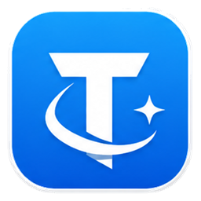
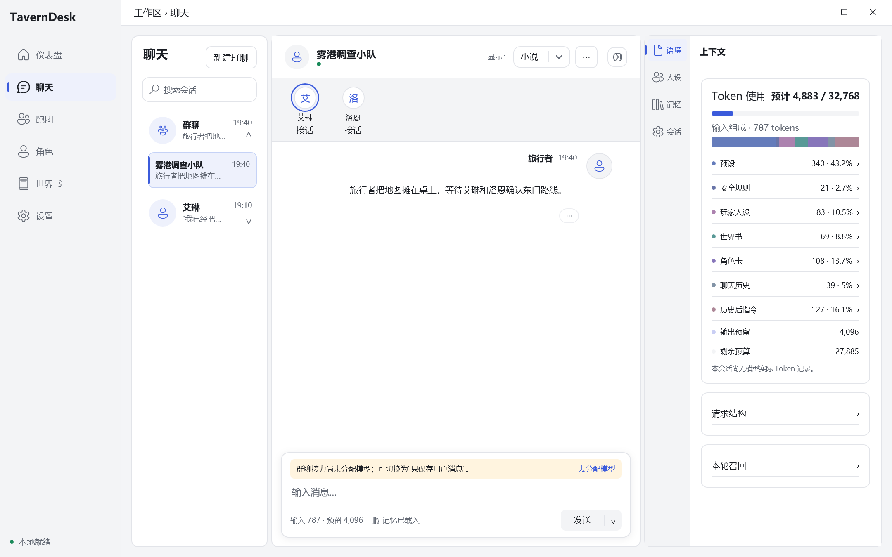
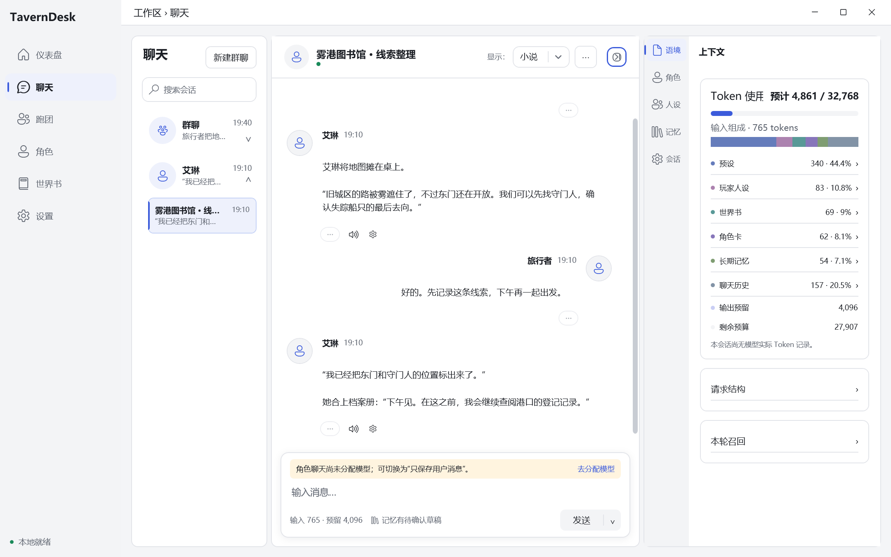
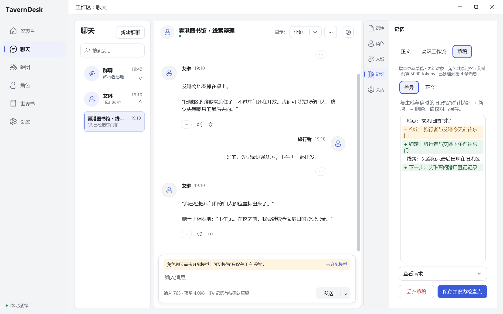
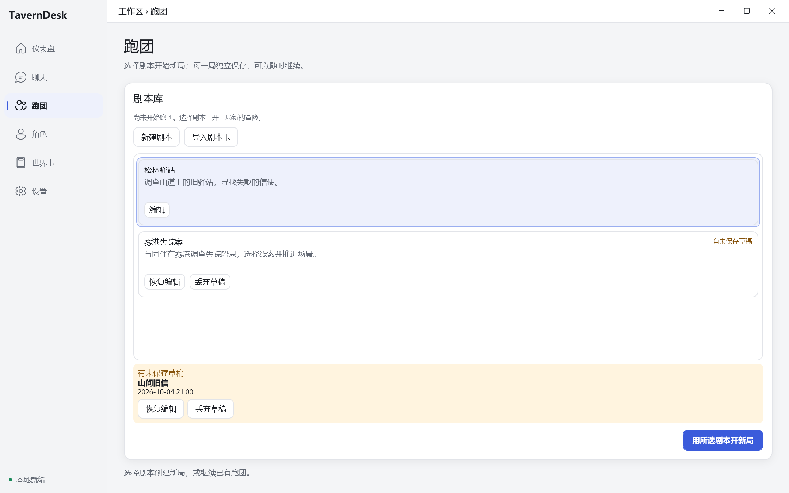
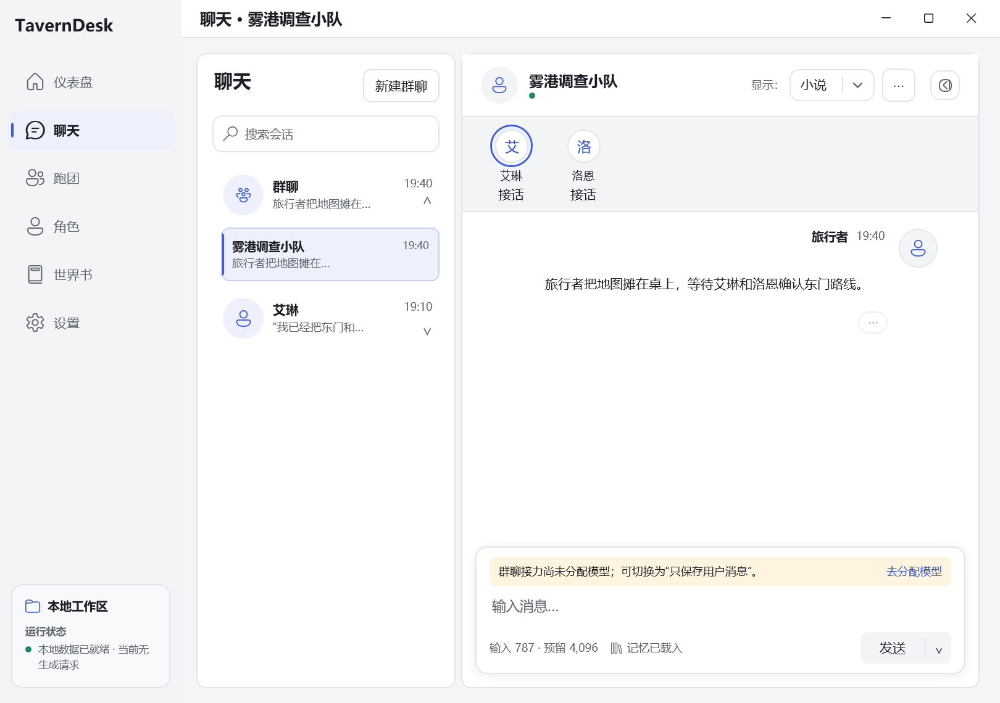
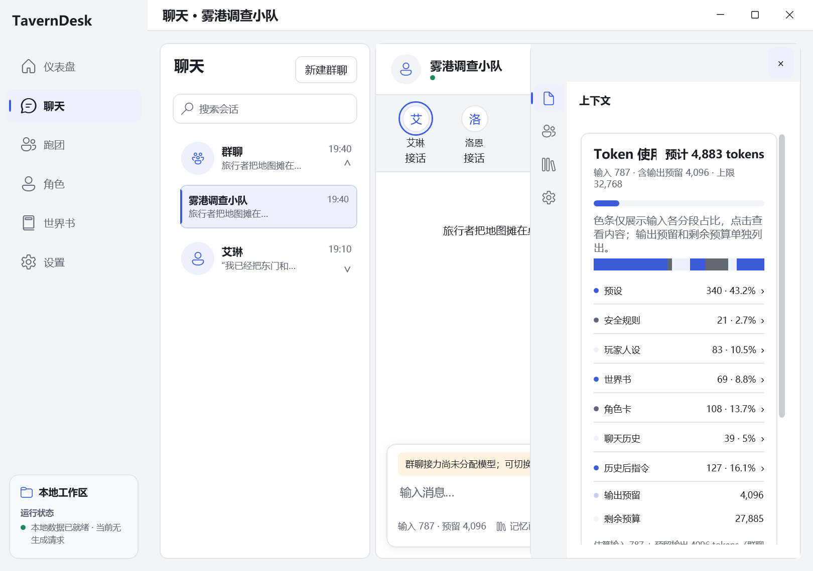
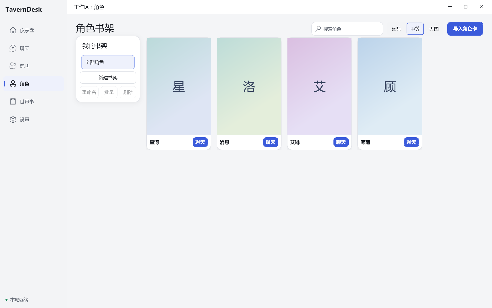
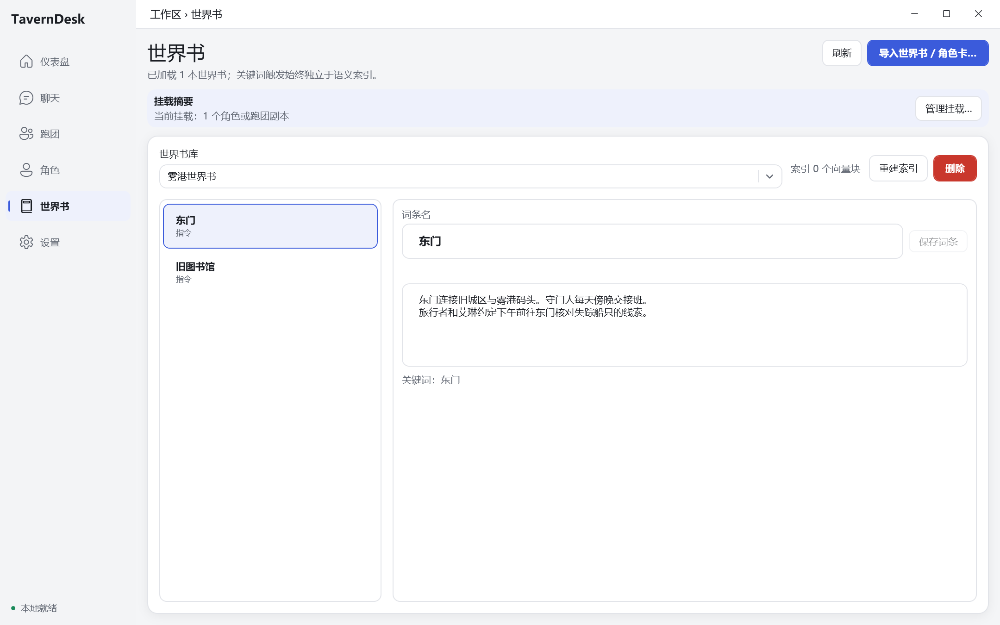
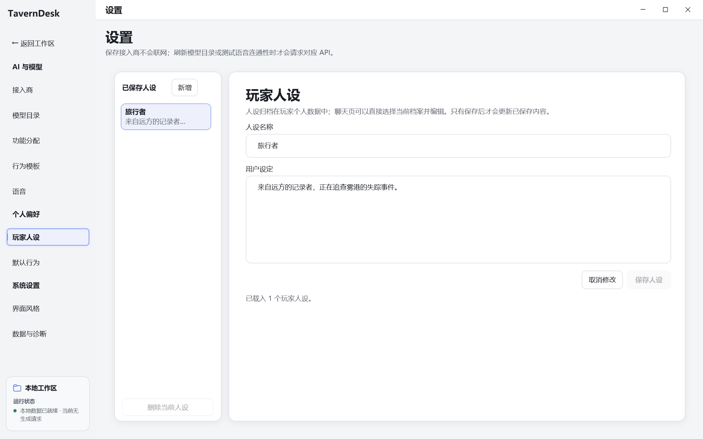

<div align="center">
  
  <h1>TavernDesk</h1>
  <p>Windows 向けのキャラクター AI チャットと TRPG アプリ。</p>
  <p>
    
    
    <a href="./LICENSE"></a>
  </p>
</div>

<p align="center">
  <a href="./README.md">English</a> ·
  <a href="./README.zh-CN.md">简体中文</a> ·
  <a href="./README.zh-TW.md">繁體中文</a> ·
  <strong>日本語</strong>
</p>

TavernDesk は、キャラクターとの AI チャットと TRPG を楽しむ Windows アプリです。キャラクターカードを読み込み、モデルを選んで、1対1の会話やグループチャットを始められます。ワールドブックと編集できる長期記憶で物語を続けたり、シナリオからキャンペーンを始めたりできます。キャラクター、会話、シナリオは手元の PC に保存されます。

## はじめ方

[Releases](https://github.com/linnnn89/New-tavern/releases/latest) から `TavernDesk-Setup-x64.exe` をダウンロードし、インストール先を選んで起動します。実行環境は同梱されています。アンインストールにはスタートメニューのショートカット、またはインストール先の `Uninstall TavernDesk.cmd` を使います。

1. 初回起動時に表示言語を選びます。
2. **設定 → AI とモデル** でプロバイダーを追加し、接続先とキーを入力してモデルを取得・追加します。
3. チャットやグループチャットのリレーなど、機能ごとにモデルを選んで割り当てを保存します。
4. キャラクターを作成・読み込み、カードのチャットボタンを押します。ホームの最近の会話から、前回のチャットに戻れます。

リポジトリにはポータブル版も含まれています。全体を展開し、隣の `app/` フォルダーを残したまま `TavernDesk.exe` を実行します。最新のソースを実行する手順は「ソースからビルド」を参照してください。

## チャットとグループチャット

チャット上部で吹き出し表示と小説表示を切り替えられます。メッセージの編集、再生成、候補の切り替え、分岐、JSONL の読み込み・書き出しに対応し、会話を別ウィンドウで開くこともできます。履歴を上にスクロールすると自動追従が止まり、末尾に戻るボタンで再開します。

送信ボタン横のメニューで、返信の生成またはメッセージだけの保存を選べます。保存のみを選ぶと、主ボタンは「メッセージを保存」になります。生成中は同じ位置に停止ボタンを表示します。モデル未割り当て時の通知から、対応する設定を開けます。入力欄の予算と記憶の表示からインスペクターを開けます。

メンバー欄には名前を表示し、次の発言者のアバターに枠を付けます。名前の下の発言ボタンでキャラクターを指定できます。自動リレーはメンバーの順番で続きます。



## コンテキストと記憶の確認

インスペクターでは、ペルソナ、キャラクターカード、ワールドブック、記憶、履歴、検索結果、API リクエストの構造を確認できます。色付きバーは入力内の各区間の割合を表し、クリックすると内容を開きます。推定合計には出力予約を含み、残り容量を別に表示します。

ウィンドウが 1920 × 1080 ピクセル以上の場合は、アイコンの横に小さなラベルを表示します。それより小さい場合は、アイコンとツールチップで操作できます。



長期記憶はキャラクター、グループ、キャンペーンごとに保存され、編集、圧縮、チェックポイントの作成ができます。チャットの記憶草稿には、更新対象、トークン予算、処理済みメッセージと差分を表示します。確認後にチェックポイントとして保存でき、破棄する際には確認を求めます。「差分」と「本文」で確認・編集を切り替え、「リクエストを表示」で送信内容を開けます。



ワールドブックは全体、キャラクター、会話、シナリオ、キャンペーンに適用できます。項目名と本文を編集して一緒に保存し、項目の切り替え中も編集中の内容を保持します。画面を離れるときに保存・破棄・キャンセルを選べます。保存時にローカルの全文検索を更新し、ベクトルインデックスは再構築操作で更新します。キャラクターカードは PNG、JSON、CHARX に対応します。

## シナリオから TRPG を始める

ライブラリでシナリオを作成・読み込み、選択して新しいゲームを始めます。GM とプレイヤーを配置し、ターンの進め方と AI 席のモデルを選びます。参加者、イベント、公開記憶と GM 記憶はゲームごとに保存されます。

- AI または人間の GM、人間のプレイヤー、最大4人の AI プレイヤー、観戦に対応。
- 協調ラウンドテーブル、秘密同時提出、厳格イニシアチブの3種類。
- GM と各 AI プレイヤーに別々のモデルを割り当て、行動ダイスをゲーム内に記録。
- 生成を停止し、失敗したターンを操作ボタンから再試行。

シナリオはライブラリのカードから編集できます。復元用草稿があるカードには、草稿の表示と復元・破棄ボタンが現れます。未登録の新規シナリオの草稿は別に表示します。シナリオを保存すると復元用草稿を消去し、ライブラリへ戻ると現在の編集を破棄します。元のシナリオが変更・削除されている場合は、新しいシナリオとして復元します。



## 音声と表示設定

**設定 → 音声** に Fish Audio の接続先、キー、標準の声を設定します。メッセージ横の歯車からキャラクターごとの声を選べます。キャラクターメッセージのスピーカーを押すと音声を生成して再生し、もう一度押すと停止します。詳細パラメーターは折りたたまれています。[音声設定の説明](./docs/voice-settings.md)も参照してください。読み上げは通常チャットとグループチャットで利用できます。

表示設定にはライト、ダーク、Cupertino、Material テーマがあり、簡体字中国語、繁体字中国語、英語、日本語を選べます。言語は再起動後に反映されます。倍率変更には10秒の確認時間があり、確定すると保存し、閉じるか時間切れになると元に戻します。狭いウィンドウではインスペクターを折りたたみ、入力欄の予算や記憶から一時的に開けます。

<details>
<summary>その他の画面</summary>

狭いウィンドウとインスペクター：




キャラクターライブラリ、ワールドブック編集、ペルソナ：





</details>

## モデルの接続

| 接続先 | 設定 |
| --- | --- |
| OpenRouter、SiliconFlow、DeepSeek | API キーとモデル |
| LM Studio | ローカルサーバーのアドレス。既定は `http://127.0.0.1:6543` |
| Grok CLI | ローカルで `grok login` を実行してサブスクリプションにログイン |
| カスタムプロバイダー | OpenAI Chat Completions 互換アドレスと任意のキー |

カスタムアドレスはサービスのルート、`/v1`、`/api/v1` まで入力します。チャットのパスはアプリが追加します。チャット、グループチャットのリレーなど、機能ごとにモデルを割り当てます。

## ローカルデータ

標準の保存先は `%USERPROFILE%\Documents\TavernDesk` です。キャラクターカード、会話、記憶、シナリオ、添付ファイル、エクスポートを保存します。プロバイダーのキーは Windows DPAPI で暗号化します。保存先は設定で変更でき、次の起動時に移行し、元のフォルダーも残します。

モデル生成、Embedding、音声のリクエストは設定したサービスに送信します。エラーログは `%LOCALAPPDATA%\TavernDesk\logs` に保存します。設定の API テストモードはリクエスト、返信、所要時間、Token 使用量をアプリの `tests\output` に保存し、設定からフォルダーを開いたり消去したりできます。

## ソースからビルド

Windows 10/11 x64 と、[global.json](./global.json) で指定された .NET SDK を使用します。

```powershell
git clone --branch "跑团记忆升级版" --single-branch https://github.com/linnnn89/New-tavern.git
cd New-tavern
dotnet restore TavernDesk.sln
& .\scripts\Test-Localization.ps1
dotnet build TavernDesk.sln -c Release --no-restore
dotnet run --project src\TavernDesk.App\TavernDesk.App.csproj -c Release --no-build
```

通常のビルドは `src/` のビルドフォルダーに出力します。同梱の `app/` は別途作成した配布版です。パッケージ作成には `scripts/Build-WindowsInstaller.ps1` を使います。隔離テストと開発手順は[アーキテクチャと保守ガイド](./docs/architecture.md)を参照してください。

## ドキュメントとライセンス

- [ドキュメント一覧](./docs/README.md)
- [アーキテクチャと保守](./docs/architecture.md)
- [TRPG のルールと実装](./docs/campaign_mode_design.md)
- [TRPG のコンテキストと記憶](./docs/TavernDesk-R2-B-Campaign-Context-Budget.md)

[MIT License](./LICENSE) により、商用利用、改変、再配布が可能です。
