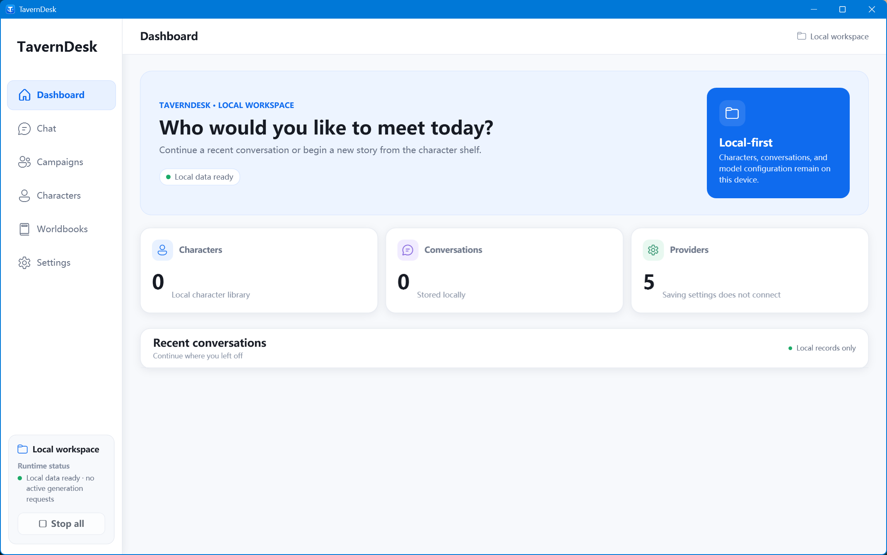
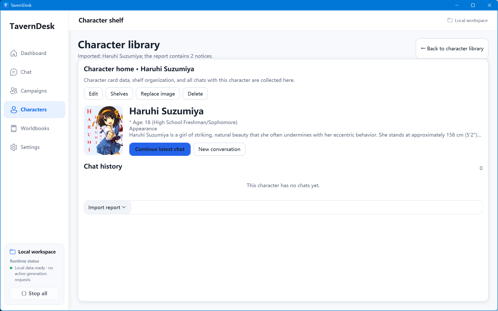
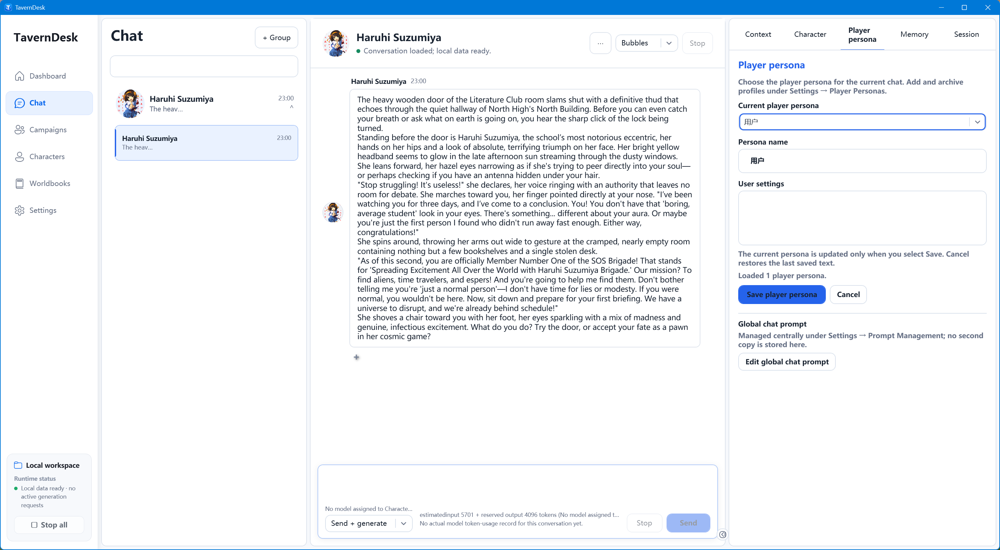
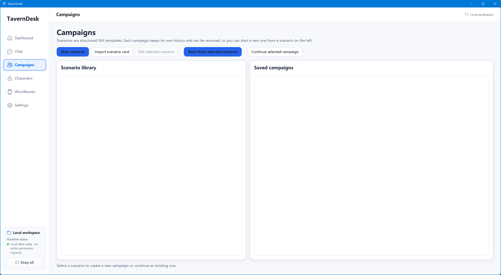
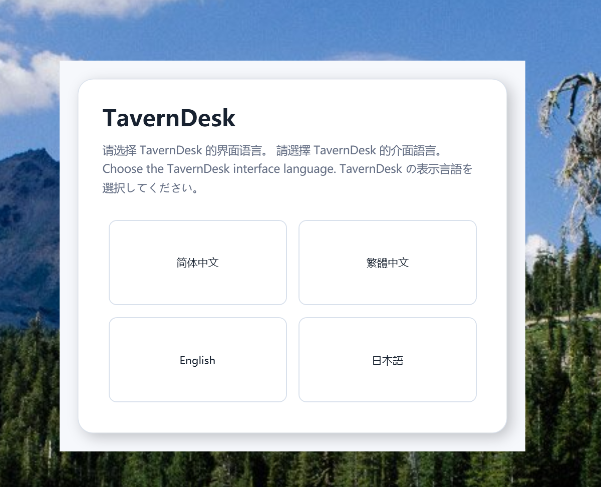

<div align="center">
  
  <h1>TavernDesk</h1>
  <p>A local-first Windows desktop for character-driven AI conversations, long-term memory, worldbooks, and structured tabletop campaigns.</p>
  <p>
    
    
    <a href="./LICENSE"></a>
  </p>
</div>

<p align="center">
  <strong>English</strong> ·
  <a href="./README.zh-CN.md">简体中文</a> ·
  <a href="./README.zh-TW.md">繁體中文</a> ·
  <a href="./README.ja-JP.md">日本語</a>
</p>

TavernDesk keeps role-play data understandable and under your control. Character cards, conversations, memory, worldbooks, and campaigns live in a local SQLite workspace. You choose the model provider, inspect what will be sent, and decide when persistent state changes.

It is built for long-running character interactions rather than one-off prompts: ordinary chat and tabletop campaigns have separate state, memory has visible drafts and checkpoints, and campaign turns are coordinated by explicit player and GM rules.

## Screenshots

<p align="center">
  
</p>
<p align="center"><sub>A clean local workspace with characters, conversations, and provider status at a glance.</sub></p>

<table>
  <tr>
    <td width="50%">
      
      <p align="center"><sub>Character cards, profile tools, shelves, and conversation history in one place.</sub></p>
    </td>
    <td width="50%">
      
      <p align="center"><sub>A four-column chat workspace with message history and an inspectable context panel.</sub></p>
    </td>
  </tr>
  <tr>
    <td width="50%">
      
      <p align="center"><sub>Separate scenario and campaign libraries for structured tabletop sessions.</sub></p>
    </td>
    <td width="50%">
      
      <p align="center"><sub>First-run interface selection for Simplified Chinese, Traditional Chinese, English, and Japanese.</sub></p>
    </td>
  </tr>
</table>

<p align="center"><sub>The character card and conversation shown here are user-imported examples and are not bundled with TavernDesk.</sub></p>

## Why TavernDesk

- **Memory you can inspect.** Long-term memory is stored per character, group, or campaign. Updates can be previewed, edited, checkpointed, and saved instead of disappearing into an opaque global memory layer.
- **Chat and campaigns stay separate.** A campaign has its own scenario, participant snapshots, event stream, GM state, and memory. It does not silently rewrite a character's ordinary chat history.
- **Structured multi-character play.** Campaign mode supports AI or human GMs, human and AI players, three turn-flow presets, per-seat model routing, dice records, validation, cancellation, and retryable failures.
- **Visible context assembly.** The context inspector shows token estimates, request segments, worldbook matches, retrieval diagnostics, exclusions, and the API request structure before generation.
- **Bring your own provider and data.** Use a supported cloud endpoint, a local LM Studio server, or Grok CLI subscription login. Your library remains in your own Windows data directory.
- **Compatible character assets.** Import and export SillyTavern-style PNG, JSON, and CHARX character cards while preserving supported embedded data and attached resources.

## Features

### Character library and conversations

- Character shelves, search, sorting, cover sizes, batch organization, and editable character profiles.
- One-to-one chat, group chat, multiple conversations, independent chat windows, streaming, cancellation, and continuation.
- In-place message editing, alternate replies, regeneration, branch-from-message, and JSONL chat import/export.
- Bubble and novel display modes. In bubble mode, user messages stay on the right and character messages stay on the left, including group chats.
- Persona selection, alternate greetings, system prompts, post-history instructions, and per-character model assignments.

### Memory, context, and worldbooks

- Character, group, and campaign memory with editable drafts, checkpoints, compression, and configurable update intervals.
- Fixed, inspectable context ordering for persona, character card, worldbook, memory, history, retrieval results, post-history instructions, and current input.
- Local token estimation for known OpenAI tokenizers, with an explicit fallback for unknown models.
- Worldbooks mounted globally, per character, per conversation, per scenario, or per campaign run.
- SillyTavern-style deterministic keyword rules, including selective matching, recursion, probability, groups, regular expressions, whole-word matching, and depth-based insertion.
- SQLite FTS5 retrieval with optional embedding-based hybrid ranking. Local previews do not call an embedding service.

### Tabletop campaign mode

Campaign mode is a separate runtime, not group chat with an extra GM prompt.

- One GM, a human user, and zero to four AI players.
- AI GM, human GM, player-and-GM, and observer arrangements.
- Collaborative roundtable, secret simultaneous submission, and strict initiative flows.
- Frozen starting snapshots for characters, persona, world rules, GM instructions, narrative permissions, and model routing.
- Different provider/model assignments for every AI player and GM seat.
- Recorded `1d20` action rolls plus optional public dice expressions.
- Deterministic validation before a GM result advances the round or updates persistent campaign state.
- Campaign-specific public and GM memory, context budgets, cancellation, and explicit retries.

### Desktop experience

- Native WPF interface for Windows 10/11 x64.
- Four-column chat workspace with a collapsible context inspector.
- Light and charcoal-dark themes, interface scaling, and configurable fonts.
- Interface languages: Simplified Chinese, Traditional Chinese, English, and Japanese.
- First-run language selection for a new workspace; later changes are available in Settings.

## Quick start

For players, the recommended option is the `TavernDesk-Setup-x64.exe` installer in the repository root:

1. Run the installer and choose the setup language.
2. Choose an installation folder and whether to create Desktop and Start menu shortcuts.
3. Launch TavernDesk, choose the application language on first run, then open **Settings → AI & Models** to configure a provider and assign models.

The installer includes a private .NET 10 runtime and all required dependencies. It does not create registry entries and therefore does not appear in Windows Installed apps. Use the Start menu uninstall shortcut, or `Uninstall TavernDesk.cmd` in the installation folder. Upgrade and uninstall remove setup-managed program files and `tests\output`; unrelated files later placed in the install folder are left intact.

The repository also includes a portable self-contained `win-x64` build. .NET does not need to be installed to run it:

1. [Download the repository ZIP](https://github.com/linnnn89/New-tavern/archive/refs/heads/%E8%B7%91%E5%9B%A2%E8%AE%B0%E5%BF%86%E5%8D%87%E7%BA%A7%E7%89%88.zip) and extract it, or clone the repository.
2. Keep `TavernDesk.exe` beside the complete `app/` directory.
3. Run `TavernDesk.exe` and choose an interface language.
4. Open **Settings → AI & Models** to configure a provider and assign models.

```powershell
git clone --branch "跑团记忆升级版" --single-branch https://github.com/linnnn89/New-tavern.git
cd New-tavern
.\TavernDesk.exe
```

`TavernDesk.exe` is a small launcher; the application runtime remains in `app/`. Copying the launcher by itself will not work.

## Model providers

| Connection | Authentication | Notes |
| --- | --- | --- |
| OpenRouter | API key | OpenAI-compatible chat and model catalog |
| SiliconFlow | API key | OpenAI-compatible |
| DeepSeek API | API key | OpenAI-compatible, including cache usage fields |
| LM Studio | Local server | Default address: `http://127.0.0.1:6543` |
| Grok CLI | Local subscription login | Uses local `grok login`; TavernDesk does not request a Grok API key |
| Custom provider | Optional API key | Must expose an OpenAI Chat Completions-compatible API |

Custom endpoints should end at the service root, `/v1`, or `/api/v1`; do not append `/chat` or `/chat/completions`. Native Anthropic Messages and Gemini APIs are not currently supported. TavernDesk is a client and does not include a model runtime or model downloader.

## Local data and network boundaries

The default workspace is `%USERPROFILE%\Documents\TavernDesk`. It contains the SQLite database, character and scenario cards, exports, attachments, and protected provider secrets. The selected workspace path is recorded in `%LOCALAPPDATA%\TavernDesk\config.json` and can be migrated from Settings.

API keys are stored as Windows DPAPI `CurrentUser`-protected files; SQLite stores only random references. TavernDesk has no built-in cloud sync. Local-first does not mean every generation is offline: prompts and conversation context are sent to the provider you select when you make a generation or embedding request.

Privacy-safe rolling error logs are written to `%LOCALAPPDATA%\TavernDesk\logs`; they contain error categories, exception types, redacted call locations, and status, and do not intentionally collect API request/reply bodies or authorization headers. The optional API test mode in Settings is off by default. When enabled, it writes request bodies, visible replies, timings, and token usage to `tests\output` under the application root for local analysis; the UI warns that those files contain conversation content and can open or clear the folder directly. Authorization headers, cookies, hidden reasoning text, and full embedding vectors are not intentionally recorded, and known key formats are redacted, but arbitrary secrets embedded in ordinary text cannot always be recognized. Do not put keys or personal data in prompts, names, addresses, or error text. Installed test output is removed during both upgrade and uninstall.

## Build from source

Requirements: Windows 10/11 x64 and the .NET SDK version selected by [`global.json`](./global.json).

```powershell
dotnet restore TavernDesk.sln
& .\scripts\Test-Localization.ps1
dotnet build TavernDesk.sln -c Release --no-restore
dotnet run --project src\TavernDesk.App\TavernDesk.App.csproj -c Release --no-build
```

The source of truth is in `src/`. The checked-in `app/` directory is a runnable publication snapshot and is not updated by an ordinary `dotnet build`.

## Documentation

- [Architecture baseline](./docs/architecture.md)
- [Campaign mode design](./docs/campaign_mode_design.md)
- [Campaign context budget](./docs/TavernDesk-R2-B-Campaign-Context-Budget.md)

## License

TavernDesk is available under the [MIT License](./LICENSE). Commercial use, modification, and redistribution are permitted under its terms.
