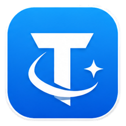

<div align="center">
  
  <h1>TavernDesk</h1>
  <p>面向 Windows 的本機優先角色 AI 對話、長期記憶、世界書與結構化跑團用戶端。</p>
  <p>
    
    
    <a href="./LICENSE"></a>
  </p>
</div>

<p align="center">
  <a href="./README.md">English</a> ·
  <a href="./README.zh-CN.md">简体中文</a> ·
  <strong>繁體中文</strong> ·
  <a href="./README.ja-JP.md">日本語</a>
</p>

TavernDesk 希望把角色扮演所依賴的資料留在使用者手中，並讓它們始終看得見、改得動。角色卡、聊天、記憶、世界書和跑團儲存在本機 SQLite 資料目錄；模型由使用者選擇，上下文可在送出前檢查，長期狀態何時更新也由使用者決定。

它更適合持續發展的角色關係，而不是一次性的提示詞：一般聊天與跑團各自維護狀態，記憶有明確的草稿與檢查點，跑團回合則由玩家、GM 和流程規則共同推進。

## TavernDesk 有什麼不同

- **記憶不是黑箱。** 長期記憶按角色、群聊或跑團分別儲存，可預覽、編輯、壓縮、設定檢查點，再決定是否寫入。
- **聊天與跑團互不干擾。** 跑團擁有獨立的劇本、參與者快照、事件流、GM 狀態和記憶，不會暗中改寫角色的一般聊天歷史。
- **多角色協作有明確規則。** 跑團支援 AI 或真人 GM、真人與 AI 玩家、三種回合流程、按席位分配模型、骰子記錄、結果驗證、取消和失敗重試。
- **上下文可以核對。** 檢查器會顯示 Token 估算、請求分段、世界書命中、檢索診斷、排除項目和實際 API 請求結構。
- **模型和資料由你選擇。** 可以連接雲端服務、本機 LM Studio 或 Grok CLI 訂閱登入，角色庫始終儲存在自己的 Windows 資料目錄。
- **相容常用角色資產。** 支援匯入和匯出 SillyTavern 風格的 PNG、JSON、CHARX 角色卡，並盡量保留內嵌資料與附帶資源。

## 主要功能

### 角色庫與對話

- 角色書架、搜尋、排序、封面尺寸、自訂分類、批次整理和完整資料編輯。
- 單聊、群聊、多會話、獨立聊天視窗、串流輸出、取消與繼續生成。
- 訊息原位編輯、多個候選回覆、重新生成、從指定訊息建立分支，以及 JSONL 聊天匯入匯出。
- 氣泡和小說兩種顯示方式。氣泡模式中，使用者訊息固定在右側，角色訊息固定在左側，群聊也遵循同一規則。
- 玩家人設、備選開場白、系統提示詞、歷史後指令，以及按角色分配模型。

### 記憶、上下文與世界書

- 角色、群聊和跑團各自擁有長期記憶，支援可編輯草稿、檢查點、壓縮和更新間隔。
- 玩家人設、角色卡、世界書、記憶、聊天歷史、檢索結果、歷史後指令和目前輸入按固定順序組裝，並可逐段查看。
- 對已知 OpenAI Tokenizer 進行本機 Token 估算；未知模型會明確使用回退估算，而不會假裝精確。
- 世界書可掛載到全域、角色、對話、劇本或某一局跑團。
- 支援 SillyTavern 風格的確定性關鍵字規則，包括選擇性比對、遞迴、機率、互斥群組、正規表示式、完整單字比對和 depth 注入。
- 使用 SQLite FTS5 檢索，並可疊加 Embedding 混合排序；本機預覽不會呼叫 Embedding 服務。

### 獨立跑團

跑團是獨立執行域，不是「群聊再加一段 GM 提示詞」。

- `1 名 GM + USER + 0–4 名 AI 玩家`。
- 支援 AI GM、真人 GM、USER 同時擔任玩家與 GM，以及純觀察模式。
- 協作圓桌、秘密同投、嚴格先攻三種回合流程。
- 開局凍結角色、玩家人設、世界規則、GM 指令、敘事權限和模型路由快照。
- 每個 AI 玩家與 GM 席位可使用不同的 Provider 和模型。
- 自動記錄行動 `1d20`，也可另外擲公開骰子算式。
- GM 結果通過確定性驗證後，才會推進回合或更新持久化跑團狀態。
- 每局獨立的公開/GM 記憶、上下文預算、取消和明確重試。

### Windows 桌面體驗

- 原生 WPF 介面，支援 Windows 10/11 x64。
- 四欄聊天工作區，右側上下文檢查器可收合。
- 預設淺色與深炭黑主題、介面縮放和全域字型設定。
- 介面語言：简体中文、繁體中文、English、日本語。
- 新資料目錄首次啟動時選擇語言，之後可在設定中變更。

## 快速開始

一般玩家建議直接使用根目錄的 `TavernDesk-Setup-x64.exe` 安裝程式：

1. 執行安裝程式並選擇安裝介面語言。
2. 自訂安裝目錄，並選擇是否建立桌面和開始功能表捷徑。
3. 啟動 TavernDesk，首次執行時選擇應用程式介面語言，再開啟 **設定 → AI 與模型** 設定接入商並分配模型。

安裝包內含私有 .NET 10 執行階段和全部必要依賴，不建立登錄項目，因此不會出現在 Windows「已安裝的應用程式」清單中。可使用開始功能表的解除安裝捷徑，或安裝目錄中的 `Uninstall TavernDesk.cmd` 解除安裝。解除安裝只會刪除安裝程式管理的程式檔案和 `tests\output`；使用者之後放入安裝目錄的其他檔案會保留。

倉庫同時保留可直接執行的 `win-x64` 可攜式自包含版本，使用它也不需要另外安裝 .NET：

1. [下載倉庫 ZIP](https://github.com/linnnn89/New-tavern/archive/refs/heads/%E8%B7%91%E5%9B%A2%E8%AE%B0%E5%BF%86%E5%8D%87%E7%BA%A7%E7%89%88.zip) 並完整解壓縮，或使用 Git 複製倉庫。
2. 保持 `TavernDesk.exe` 與完整的 `app/` 目錄位於同一層級。
3. 執行 `TavernDesk.exe`，選擇介面語言。
4. 開啟 **設定 → AI 與模型**，設定接入商並分配模型。

```powershell
git clone --branch "跑团记忆升级版" --single-branch https://github.com/linnnn89/New-tavern.git
cd New-tavern
.\TavernDesk.exe
```

`TavernDesk.exe` 是一個很小的啟動器，完整執行環境位於 `app/`。只複製根目錄 EXE 無法啟動應用程式。

## 模型接入

| 接入方式 | 驗證 | 說明 |
| --- | --- | --- |
| OpenRouter | API Key | OpenAI-compatible 聊天與模型目錄 |
| 矽基流動 | API Key | OpenAI-compatible |
| DeepSeek 官方 API | API Key | OpenAI-compatible，並讀取快取使用欄位 |
| LM Studio | 本機服務 | 預設位址：`http://127.0.0.1:6543` |
| Grok CLI | 本機訂閱登入 | 使用本機 `grok login`；TavernDesk 不要求 Grok API Key |
| 自訂接入商 | API Key 可選 | 必須提供與 OpenAI Chat Completions 相容的 API |

自訂位址填寫到服務根、`/v1` 或 `/api/v1` 即可，不要加上 `/chat` 或 `/chat/completions`。目前不支援 Anthropic Messages 和 Gemini 原生協定。TavernDesk 是用戶端，不包含本機模型執行環境或模型下載器。

## 本機資料與網路邊界

預設資料目錄為 `%USERPROFILE%\Documents\TavernDesk`，其中儲存 SQLite 資料庫、角色卡、劇本卡、匯出、附件和受保護的接入商金鑰。目前目錄記錄在 `%LOCALAPPDATA%\TavernDesk\config.json`，也可從設定中搬移。

API Key 以 Windows DPAPI `CurrentUser` 保護檔案儲存，SQLite 只記錄隨機參照。TavernDesk 不提供內建雲端同步。「本機優先」不等於所有生成都離線：發起生成或 Embedding 請求時，提示詞和必要的對話上下文會送到你選擇的服務。

隱私安全的滾動錯誤日誌預設寫入 `%LOCALAPPDATA%\TavernDesk\logs`，只包含錯誤類別、例外類型、去識別化後的呼叫位置和狀態，不主動收集 API 請求/回覆正文或授權標頭。設定中的 API 測試模式預設關閉；開啟後會把請求正文、可見回覆、耗時和 Token 用量寫入軟體根目錄下的 `tests\output`，介面會明確提示其中含有對話內容，並可直接開啟或清空目錄。軟體不主動記錄授權標頭、Cookie、隱藏思考文字或完整 Embedding 向量，並會遮罩已知 Key 格式，但無法識別普通正文中的任意秘密；請勿把 Key 或個人資料寫入提示詞、名稱、位址或錯誤文字。安裝版解除安裝時會一併刪除測試輸出。

## 從原始碼建置

需要 Windows 10/11 x64，以及 [`global.json`](./global.json) 指定的 .NET SDK。

```powershell
dotnet restore TavernDesk.sln
& .\scripts\Test-Localization.ps1
dotnet build TavernDesk.sln -c Release --no-restore
dotnet run --project src\TavernDesk.App\TavernDesk.App.csproj -c Release --no-build
```

原始碼基準位於 `src/`。倉庫中的 `app/` 是可執行的發佈快照，一般 `dotnet build` 不會自動更新它。

## 專案文件

- [架構基線](./docs/architecture.md)
- [獨立跑團模式設計](./docs/campaign_mode_design.md)
- [跑團上下文預算](./docs/TavernDesk-R2-B-Campaign-Context-Budget.md)

## 授權條款

TavernDesk 採用 [MIT License](./LICENSE)。在遵守授權條款的前提下，允許商業使用、修改與再散布。
