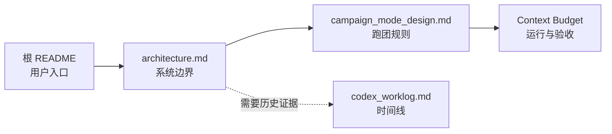

# TavernDesk 文档导航

这里保存源码维护、跑团规则和验证证据。普通用户的安装、功能与模型配置请先看仓库根目录 README；准备阅读源码或继续开发时，从本页开始。

## 推荐阅读顺序

1. [`architecture.md`](architecture.md)：先理解模块、数据边界、请求生命周期、安全约束和当前证据。
2. [`campaign_mode_design.md`](campaign_mode_design.md)：涉及独立跑团时，再读参与者权限、三种流程、事件状态和叙事门禁。
3. [`TavernDesk-R2-B-Campaign-Context-Budget.md`](TavernDesk-R2-B-Campaign-Context-Budget.md)：调试跑团上下文、Token、GM/Public 记忆或长局行为时阅读。
4. [`codex_worklog.md`](codex_worklog.md)：只在查历史变更、旧故障或某次验证证据时搜索，不建议从头通读。

## 每份文档只回答一个问题

| 文档 | 回答的问题 | 不保存的内容 |
| --- | --- | --- |
| `architecture.md` | 系统如何分层，哪些数据和生命周期边界不能破坏 | 逐次开发流水、跑团完整规则 |
| `campaign_mode_design.md` | 一局跑团如何运行，谁能看见和改变什么 | 旧阶段施工计划、重复测试明细 |
| `TavernDesk-R2-B-Campaign-Context-Budget.md` | 模型本轮看到什么，预算和记忆如何验证 | 旧分支/提交号、会话 ID、已完成工作包 |
| `codex_worklog.md` | 某次改动做了什么、验证到哪里 | 面向新读者的产品或架构总览 |

## 当前阅读口径

- 文档状态日期为 2026-08-14；工作区之后可能继续变化，具体实现以当前源码和实际验证为准。
- 当前群聊接力口径是固定成员顺序与头像“立即接话”；模型输出的 `@` 不再参与选人或暂停。旧 `@` 枚举和提示只为旧数据库兼容保留，详细边界见 [`architecture.md`](architecture.md)。
- 自动化通过不等于真实 Provider、真实长局或完整 UI 已验收；各文档会明确区分已验证与未验证。
- 不从工作日志中的旧测试数、旧分支名或阶段标签推断当前状态。
- 新功能或修复应更新对应主题文档；只有时间线证据写入 `codex_worklog.md`。
- 不把同一规则复制到多份文档。需要跨主题说明时使用链接，并让一个文件成为事实来源。
