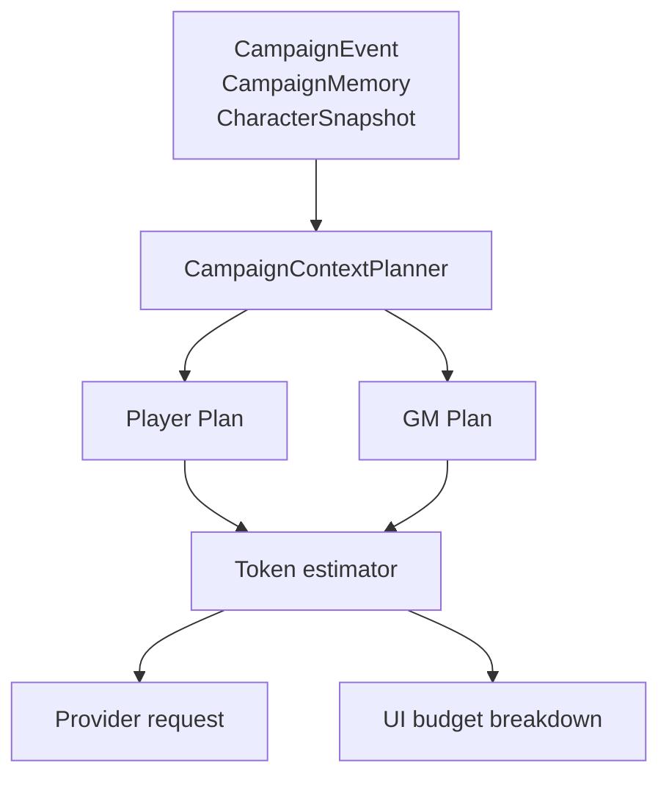

# TavernDesk 跑团上下文与记忆运行指南

状态日期：2026-08-11（北京时间）

本文说明当前跑团上下文预算、长期记忆和实际验收方法。它不再保存旧分支、提交号、会话 ID、逐文件施工计划或已经完成的工作包。跑团产品规则与事件生命周期见 [`campaign_mode_design.md`](campaign_mode_design.md)。

## 1. 当前结论

`CampaignContextPlanner` 是跑团上下文的单一来源：同一个 Plan 同时驱动 Provider 请求和界面 Token 明细，避免“预览看见的内容”和“模型实际收到的内容”漂移。



当前策略：

- 固定资料和当前回合优先，属于 mandatory context；
- 固定资料或当前回合超限时阻止请求，不静默裁剪角色卡、规则或当前行动；
- 长期记忆有单独上限，不能无限挤压近期原始事件；
- 更旧历史可以按预算退出，并返回明确的 `HistoryTrimmed` 诊断；
- GM 与 Public 记忆在调用模型前按事件可见性分流；
- 每局可关闭长期记忆，关闭后不总结、不注入，但保留原始事件与已有 checkpoint。

## 2. 输入预算

### 有效预算

每个 AI GM 或单个 AI 玩家请求独立计算输入预算：

```text
EffectiveInputBudget = min(CampaignContextTokenBudget, ModelInputLimit)
```

- `ContextTokenBudget` 默认 `15,000`。
- 可配置范围由领域模型校验，当前为 `8,000–200,000`。
- 输出上限独立配置，不从输入预算中扣除。
- 15,000 不是整回合所有模型调用的合计，也不是 Provider 的精确计费值。
- Token 估算用于本地门禁和分配；服务端消息模板与 tokenizer 差异仍可能使实际 usage 不同。

### 分配优先级

```text
1. 安全、身份、权限与输出协议
2. 冻结角色/Persona/世界规则
3. 最新 GM 场景和当前回合行动
4. GM 或 Public 长期记忆
5. 近期已裁定事件
6. 更旧历史
```

前三类是 mandatory context。任何历史或记忆裁剪都不能把当前行动者、当前待裁定行动或最新 GM 场景挤出请求。

### 长期记忆占用

长期记忆最多使用 `3,000` tokens，并且不超过 mandatory context 分配后剩余容量的 40%。这个限制用于给近期原始事件保留空间，不代表记忆正文在数据库中只能有 3,000 tokens。

### Plan 状态

| 状态 | 含义 | 是否可发送 |
| --- | --- | --- |
| 正常 | 所有必要分区和可用历史均纳入 | 是 |
| `HistoryTrimmed` | 旧历史因预算不足退出，必要内容仍完整 | 是，但 UI 应明确提示 |
| `BlockedMandatoryContextTooLarge` | 固定资料或当前回合超过有效输入预算 | 否 |

发生阻止时，用户应缩短固定资料、调整局内预算或选择上下文更大的模型。系统不能用自动改写角色卡、剧本或世界书作为隐式补救。

## 3. 低频跑团记忆

### 事实来源

```text
已锁定 CampaignEvent
→ 按 scope 和 checkpoint 读取新增事件
→ 代码过滤可见性
→ 普通 LLM 请求生成 GM / Public 投影
→ 校验来源事件序号
→ 原子保存 memory bank 并推进 checkpoint
```

`CampaignEvent` 始终是权威事实源。文本记忆只是派生投影，不能反向覆盖事件，也不能把未裁定的 `PlayerIntent` 写成已经发生的事实。

### 自动更新条件

默认在成功锁定 GM 裁定后检查，满足任一条件时更新：

- checkpoint 后累计 `3` 个完整轮次；
- checkpoint 后已裁定事件达到约 `4,000` tokens。

更新边界只到刚完成的 `GmResolution`。之后新一轮尚未裁定的行动不属于本批输入。

以下操作不应触发总结：

- 单纯打开或刷新跑团页面；
- 玩家提交或 AI 玩家重试；
- 额外骰点；
- 切换席位模型；
- 查看或展开上下文明细。

记忆失败不回滚已经保存的 GM 裁定，也不推进 checkpoint。重新打开或用户显式重试时可以继续处理同一未完成区间。

### GM 与 Public 分流

- GM Memory 可读取 GM 权限范围内的已锁定事件。
- Public Memory 只从 Public 事件生成。
- Public Memory 不能由完整 GM Memory 再做一次“脱敏”改写，否则模型可能泄漏隐藏信息。
- 两份记忆分别校验来源事件序号并独立推进 checkpoint。

当前没有 Participant Memory。AI 玩家读取 Public Memory、自己的冻结角色/Persona、自己的初始记忆快照和被授权的私有事件；不能读取 GM Memory。

## 4. 每局记忆 ON/OFF

`MemoryEnabled` 是每局持久化设置，默认 `ON`。

| 状态 | 总结模型 | 上下文注入 | 原始事件 | 既有 bank/checkpoint |
| --- | --- | --- | --- | --- |
| ON | 达到阈值后调用 | GM/Public 按权限注入 | 保留 | 使用并推进 |
| OFF | 不调用 | 不加入长期记忆分区 | 保留 | 保留，不删除 |

从 OFF 恢复为 ON 后：

- 不因切换开关立即追溯调用模型；
- 从原 checkpoint 继续；
- 在后续成功 GM 裁定后按当前阈值判断是否更新；
- 不重复处理已经完成的区间。

Runner、Planner、MemoryUpdateService 和 UI 都必须读取真实持久化设置，不能只靠隐藏按钮保证行为。

## 5. 运行态、取消与重试

- 普通聊天、群聊、AI 玩家、AI GM 和记忆更新统一登记到应用级生成协调器。
- 顶部状态显示等待、接收、停止、活动请求数和增量 Token 估算；局部页面不再建设第二套接收状态。
- 页面切换、重载或打开设置只刷新 UI，不取消后台 API。
- 用户可见的统一取消入口是“停止全部 API”。
- 同一跑团的记忆更新与模型生成通过共享操作门协调，避免同时改写相关状态。
- AI GM 协议失败后的成功重试仍停留在当前回合；只有用户确认且通过校验的当前候选才能锁定并推进。
- 成功替换的失败尝试可从当前活动流隐藏，但数据库仍保留审计记录。

## 6. 当前界面与诊断

跑团的“记忆设置”入口集中管理：

- 当前局输入总预算；
- AI 玩家和 GM 历史预算；
- 记忆 ON/OFF；
- 自动更新轮次间隔；
- 待处理 Token 阈值；
- 当前记忆状态与建立/重试操作。

这些设置只作用于当前跑团，不改变普通聊天记忆设置。

当前基础估算卡已经能显示本轮估算与分区明细。更完整的 Context Inspector 仍是候选增强，不应另写一套组装或 Token 估算逻辑。若实施，只能消费现有 `CampaignContextPlan`，并补足：

- 每个分区是否纳入、裁剪或阻止；
- mandatory 超限的具体分区；
- 输入使用量、输入预算、输出上限与最终状态；
- GM 与各 AI 席位分别查看；
- 普通玩家视角不默认展开 GM-only 正文。

打开、展开或刷新诊断不得调用 Provider、Embedding 或记忆模型。

## 7. 当前验证边界

最近工作记录中的可信快照：

- 2026-08-09：当时完整 Release 测试 `188/188` 通过，另有 SQLite 事务回滚定向回归；根启动探针通过。
- 2026-08-11：四语静态校验、Debug/Release 构建和隔离存储 smoke 通过；没有记录等价的完整测试重跑。

这些结果证明相应提交快照的自动化边界，不证明当前工作区、真实 Provider 或真实长局已经通过。

当前最重要的未知项：

- 10–20 轮后历史何时开始裁剪；
- GM/Public 记忆是否出现事实漂移、重复总结或秘密泄漏；
- 最新 GM 裁定后的新 `PlayerIntent` 是否始终不进入上一批记忆；
- 多角色卡、多席位和不同模型下的 Token 分区是否合理；
- Memory OFF 时是否完全没有总结请求和长期记忆分区；
- 从 OFF 恢复 ON 后是否沿用 checkpoint 且不立即追溯调用。

## 8. 建议验收流程

先用最小真实场景验证，不同步扩建功能：

1. 建立 `1 USER + 1 AI 玩家 + AI GM` 的独立测试局。
2. 连续运行 10–20 轮，至少跨过一次 3 轮或 4,000 tokens 的记忆阈值。
3. 记录首次记忆更新的轮次、触发原因和 checkpoint。
4. 记录历史首次出现 `HistoryTrimmed` 的轮次，确认最新 GM 场景与当前行动仍在。
5. 将记忆切为 OFF，完成 2–3 轮，确认没有总结请求和长期记忆分区。
6. 切回 ON，确认不会立即追溯调用；在后续 GM 裁定后按阈值继续。
7. 分别检查 GM Memory 和 Public Memory，寻找事实漂移、隐藏信息泄漏和未裁定行动混入。
8. 再增加多 AI 席位、途中换模型、席位失败重试和“停止全部 API”。

建议保存的证据：

- 每轮的输入预算、估算 Token、Plan 状态和模型；
- ON、OFF、重新 ON 三个阶段的 UI 与请求分区；
- memory bank 正文、scope、checkpoint 和来源事件序号；
- 首次裁剪、阻止、失败与重试的事件链；
- Provider 实际 usage、首字时间、流中断和错误信息。

不得在证据中保存 API Key、完整私密角色资料或可识别的个人数据。

## 9. 继续实现的门槛

### 可直接作为缺陷修复处理

- mandatory context 被静默裁剪；
- 当前行动或最新 GM 场景被旧历史挤出；
- Public Memory 混入 Private/GmOnly 内容；
- OFF 状态仍调用总结模型或注入长期记忆；
- checkpoint 在失败后推进或重复处理已完成区间；
- 预览 Plan 与实际请求结构不一致。

### 需要真实证据后再决定

- 更完整的 Context Inspector；
- 行为不变地拆分 `CampaignContextPlanner`；
- Provider 上下文缓存与专用 Token 规则；
- Memory Quality Guard 或结构化记忆输出；
- `CampaignFact`、Participant Memory、关系/任务图和向量检索；
- 持久化 barrier、后台队列或自动压缩。

上述候选不能在普通修复中顺带引入。若真实长局证明需要，应先明确问题样本、数据模型、验收标准和迁移影响，再单独实施。
