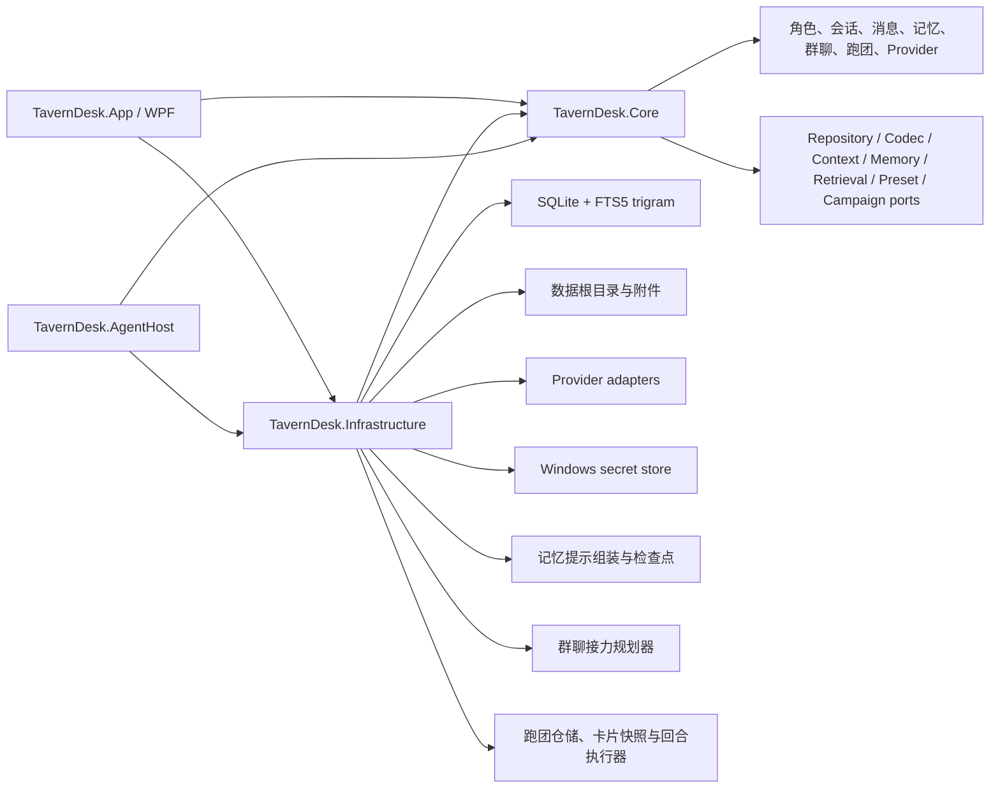

# TavernDesk 架构基线

## 1. 目标

建立一个 Windows 本地优先、可长期扩展的酒馆角色聊天客户端。架构优先保护三件事：

1. SillyTavern 数据 round-trip，不把未知字段静默丢失；
2. 上下文组装可检查、可计算、不可在超限时静默裁剪；
3. HTML、密钥、MCP 和文件工具与 WPF 主进程隔离。

## 2. 模块



### TavernDesk.App

- 窗口、导航、主题、Skin 资源和交互状态；
- 仪表盘、角色书架、聊天三栏、模型设置和独立跑团工作区；
- 不直接拼 SQL、不保存 API Key、不执行工具命令。

### TavernDesk.Core

- 不依赖 WPF 或 SQLite；
- 领域实体、仓储接口、上下文段、Token 预算结果和跑团状态机端口；
- SillyTavern codec、记忆银行、世界书和工具的扩展端口。

### TavernDesk.Infrastructure

- SQLite schema、迁移、普通聊天仓储与独立跑团仓储；
- 文件、Provider、Token、知识索引和系统安全存储；
- 所有外部输入在进入 Core 前完成解析和验证。

### TavernDesk.AgentHost

- 后续承载酒馆聊天辅助工具；
- 非管理员、可终止、授权目录边界；
- 不演化成代码工程工作台。

## 3. 初始数据模型

```text
characters
  id, name, description, personality, scenario, first_message,
  avatar_path, raw_card_json, source_card_format, source_card_path,
  import_report_json, created_at, updated_at

character_shelves
  id, name, sort_index, created_at, updated_at

character_shelf_items
  shelf_id, character_id, sort_index, added_at

conversations
  id, character_id, title, mode, created_at, updated_at

messages
  id, conversation_id, sequence_no, sender_kind, sender_id, content,
  active_candidate_index, created_at, updated_at, is_deleted

message_candidates
  id, message_id, candidate_index, content, created_at

provider_profiles
  id, name, adapter_kind, base_url, secret_reference,
  request_timeout_seconds, is_enabled, created_at, updated_at

provider_models
  provider_id, model_id, display_name, context_limit,
  max_output_tokens, supports_streaming, updated_at

model_function_assignments
  function_kind, provider_id, model_id, context_limit,
  max_output_tokens, temperature, top_p, updated_at

app_settings
  key, value, updated_at

schema_info
  version, applied_at

memory_workflow_settings
  owner_id, auto_generate_enabled, update_interval_turns,
  update/compression prompts, updated_at

memory_checkpoints
  owner_id, source_conversation_id, last_sequence_no,
  processed_user_turns, updated_at

memory_update_drafts
  id, target_owner_id, source_conversation_id, kind, body,
  request_preview, target_tokens, source_through_sequence_no,
  source_user_turns, created_at, updated_at

group_chat_settings
  conversation_id, relay_mode, auto_continue_enabled,
  maximum_automatic_turns, pause_on_user_mention,
  group/merge prompts, updated_at

group_chat_members
  conversation_id, character_id, sort_index, is_enabled

group_chat_state
  conversation_id, current_speaker_id, next_speaker_id,
  automatic_turns, is_paused, pause_reason, updated_at

retrieval_settings
  conversation_id, is_enabled, scope, recent_message_count,
  maximum_results, token_budget, updated_at

presets
  id, name, description, overlay_json, created_at, updated_at

preset_mounts
  scope_kind, scope_id, preset_id, sort_index, is_enabled

message_search_trigram
  message_id, conversation_id, content

chat_jsonl_archives
  conversation_id, source_file_name, header_json, imported_at

chat_jsonl_message_payloads
  message_id, raw_json

campaign_scenarios
  id, title, summary, world_definition, public_rules,
  lobby_instructions, gm_opening, legacy_examples_archive,
  raw_card_json, source_card_path, import_report_json,
  created_at, updated_at

campaigns
  id, scenario_id, title, status, phase, flow_preset,
  gm_kind, gm_provider_id, gm_model_id, world_definition,
  public_rules, opening_prompt, round_no, current_seat_index,
  frozen_through_sequence_no, runtime_version, created_at, updated_at

campaign_participants
  id, campaign_id, kind, display_name, sort_index, is_enabled,
  source_character_id, character_snapshot_json, memory_snapshot,
  provider_id, model_id, context_budget_tokens, created_at, updated_at

campaign_events
  id, campaign_id, sequence_no, round_no, event_kind,
  actor_participant_id, recipient_participant_id, visibility,
  content, operation_id, attempt_no, generation_status,
  end_reason, is_locked, created_at
```

`sequence_no` 是会话内唯一、稳定的消息顺序。`rowid` 只允许在 v1 → v2 迁移时一次性回填顺序，删除后续、分支、显示和上下文组装均不得再依赖它。

`messages.is_deleted` 是早期 schema 的兼容列，不再代表可用的产品状态。当前删除路径不会写入软删除状态；确认后直接物理删除消息。不能基于该列重新引入回收箱或恢复流程。

schema v3 增加角色卡源文件/导入报告和自定义书架。角色卡导入先解析并校验，再把原文件原样复制到数据根目录的 `character-cards/{character_id}/`；编辑只改变可编辑字段和数据库记录，不原位改写导入文件。PNG 同格式导出保持非 `ccv3`/`chara` chunk，CHARX 同格式导出保持全部非 `card.json` 文件，JSON 保持未知节点。

schema v4 增加模型目录和按功能分配。API Key 不进入 SQLite；`provider_profiles.secret_reference` 只保存项目数据根目录内 DPAPI 保护文件的受校验引用。密钥轮换先写新保护文件，数据库提交成功后才清理旧引用。

schema v5 增加记忆工作流、处理检查点、可编辑草稿、群聊设置/成员/接力状态。记忆生成永远先落入草稿；只有显式提交更新草稿时，才在同一事务中覆盖记忆正文并推进检查点。压缩与群聊合并草稿不推进对话处理检查点。

schema v6 增加按会话保存的召回设置、预设与作用域挂载，以及使用 SQLite FTS5 `trigram` tokenizer 的消息索引。索引由消息增删改触发器同步；永久删除会同步移除索引。召回可以限定当前会话或同角色全部会话，并接收稳定消息 ID 排除集，避免近期原文与召回结果重复。

schema v7 增加聊天 JSONL 原始头记录和逐消息原始负载。导入先把完整文件解析到内存并校验，成功后才在事务中创建角色占位、会话、消息、候选和原始负载；导出在原始对象上覆盖当前可编辑字段，因此未知字段、候选列表和活动候选可以 round-trip。

schema v8 增加 `campaign_scenarios`、`campaigns`、`campaign_participants` 和 `campaign_events`。剧本模板与每一局跑团分离，同一剧本可创建多个独立局；开始游戏时冻结角色、可选普通记忆、世界规则和模型路由快照。事件流使用稳定序号、操作 ID、尝试号、生成终态和有限结束原因表达缓存、重试、私有投递与 GM-only 状态，不修改普通 `conversations`、`messages` 或 `memory_banks` 的语义。成功的 `PlayerIntent` 在同一插入或生成终态事务内，把系统生成的 `1d20` 同时写入可见正文与 `taverndesk.campaign-action-roll.v1` 结构化数据；骰点继承事件可见性，不另建可能与行动分离的骰子事件。

跑团回合决策由一个 `CampaignFlowEngine` 路由到三种独立策略：`CollaborativeTableStrategy`、`BlindSubmissionStrategy` 和 `StrictInitiativeStrategy`。策略只产生 `CampaignActionPlan`、`CampaignResolutionPlan`、`CampaignAdvancePlan` 与统一的 `CampaignFlowSnapshot`，不执行数据库写入或 Provider 请求。`CampaignRunner`、`CampaignContextPlanner`、仓储候选提交校验和跑团 UI 读取同一份计划，因此当前可行动席位、GM 本次实际接收的 `PlayerIntent`、当前候选链及下一轮位置只有一个权威来源。协作圆桌保持公开逐席提交、全部收齐后统一裁定；秘密同投保持同快照并行及本轮互盲；严格先攻保持单席行动、立即裁定、再移动到下一席。共享部分仍只有事件持久化、流式生成、Token 预算、失败缓存与记忆更新。

GM 生成链在统一流程计划之后增加叙事权限层。`CampaignNarrativeAuthorityCompiler` 按三种流程策略分别生成权限契约，把本轮可裁定的 `PlayerIntent`、冻结的 `CampaignNarrativeState`、剧本 GM 指令以及新增 NPC、关系变化、独立剧情线三类权限放在请求末端的高优先级系统区。严格先攻契约只授权当前席位；协作圆桌与秘密同投只授权本次 resolution plan 中的已提交席位。`CampaignGmOutputValidator` 在锁定候选前校验隐藏的结构化变化声明，失败候选不得推进回合或进入记忆更新；通过后才剥离声明、保存可见正文，并把批准的变化合并回场景状态。

schema v9 为模型功能分配增加显式 reasoning 开关。当前只对 OpenRouter 且模型 ID 含完整 `deepseek` 词段的模型显示 OFF/ON 快捷设置，不建设通用推理参数框架。

schema v10 取消消息回收箱：迁移会永久清理旧版本已软删除的消息；新删除路径在同一事务中按稳定 `sequence_no` 确定范围，先清理旧 FTS 记录，再物理删除消息，候选和聊天导入负载依靠外键级联删除，trigram 索引由删除触发器同步。该迁移不删除兼容列，避免为一次产品收敛重建整张消息表。

schema v11 为 `provider_models` 增加 `model_kind` 目录来源元数据，以兼容普通目录、专用 Embedding 目录和手工录入记录；它不是模型能力判断，也不参与 API 路由。普通 OpenAI-compatible `/models` 与支持的专用 `/embeddings/models` 会合并到统一模型目录，功能分配可以从统一目录选择模型。

schema v12 增加世界书语义索引及角色/全局/跑团剧本挂载关联；schema v13 重建 Embedding profile 与向量表，移除过窄的 Provider+模型唯一约束并保留旧索引数据；schema v14 为 `memory_workflow_settings` 增加 `maximum_source_user_turns` 和 `send_only_new_messages`。记忆工作流默认每 20 个用户轮次触发一次、每次最多发送 20 个用户轮次（含角色回复），并默认只发送检查点之后的新对话；仍先生成草稿，显式保存后才推进检查点。

schema v15 增加按跑团和可见范围唯一的 `campaign_memory_banks`，以及记录已处理事件序号与轮次的 `campaign_memory_checkpoints`；两者都随所属跑团级联删除。schema v16 为每局跑团保存上下文 Token 预算、记忆更新轮次间隔和待处理 Token 阈值，默认分别为 15,000、3 轮和 4,000。schema v17 增加独立持久化的跑团记忆开关，旧跑团升级后默认开启。

schema v18 为剧本增加三类叙事权限，并在每局跑团开始时冻结 GM 指令、权限和结构化场景状态。旧活动局升级时从所属剧本回填这些字段；之后编辑剧本只影响新局，不会悄悄改变进行中的裁定契约。场景状态与成功 GM 裁定在同一运行时更新路径中保存，权限失败的候选不会修改状态。

schema v19 只修正仍保留旧默认值的 AI GM 输出上限：当 `gm_max_output_tokens` 恰为 4,096，且当前模型目录记录支持更高输出时，将其提升到模型上限与 6,000 的较小值；用户已经自定义的值、缺少匹配模型记录的跑团和模型上限不高于 4,096 的跑团均保持不变。

跑团 AI 玩家请求按事件生命周期分为四块：“已裁定共同历史”保留最新 GM 事件之前的真实时间顺序；“最新 GM 场景与裁定”是当前行动的权威世界起点；“本轮其他席位已提交内容”只收录最新 GM 之后、当前回合可见的 `PlayerIntent`；“当前回合任务”只授权 `current_actor` 提交自己的行动。每行 JSONL 在不改写原始事件正文的前提下附加运行时 `resolution_status`：GM 事件为 `confirmed_by_gm`，过去玩家意图为 `resolved_round_record`，当前回合意图为 `pending_gm_resolution`。平级玩家公开表达的台词与行动意图可以被感知、回应或用于协作，但行动成败、观察结论以及 NPC、环境和世界影响必须等待 GM 裁定；`speaker` 与 `current_actor` 仍是身份事实。角色卡快照只定义性格、背景、知识、能力、社会位置和表达风格，不能通过卡内指令取得 GM、NPC、旁白、其他席位或故事作者权限。该结构仍由单次常规 API 请求完成，不引入摘要调用、数据库事件迁移或 Agent 流程。

群聊记忆的 owner ID 为 `group:{conversation_id}`。群聊分支复制截止消息、全部消息候选、群聊设置和成员并重建 ID；新分支不复制原群聊记忆，防止分支起点之后形成的摘要泄漏到新分支。群聊状态在分支中重置。

手工编辑只覆盖当前候选文本，不保留编辑历史；重新生成产生新的候选版本。独立分支复制消息及全部候选并重建 ID，不共享消息节点。消息删除必须先选择范围并最终确认，随后永久生效；不提供回收、恢复或隐藏软删除入口。

## 4. 请求组装顺序

```text
安全与格式规则
→ 有效预设栈（global → role → chat）
→ 群聊额外 System Prompt
→ 用户 Persona / 当前发言角色提示 / 角色卡 / 群聊成员设定
→ 世界书既有 before / after 位置
→ 角色或群聊记忆银行
→ 历史消息与 at-depth 注入
→ FTS5 召回 / 知识库语义召回
→ post-history / 群聊接力指令
→ 当前输入
→ Token 估算与阻止判定
```

M4.1 已接入 global → character → conversation 预设栈、群聊额外指令、当前发言角色 system prompt/核心字段、群聊成员设定、Persona、角色世界书、角色或群聊记忆、FTS5 消息召回、带真实 provider role/角色姓名的近期历史、post-history、群聊接力指令和当前输入。默认发送顺序优先保持固定前缀：精炼职责、Persona、角色资料、普通世界资料和长期记忆位于历史前；逐轮变化的检索、post-history 与接力指令位于历史后；当前用户原文保持最后一条。单聊历史直接使用原生 role，群聊历史只增加单行 JSON `speaker` 信封；不插入会在后续轮次移动位置的历史起止标记。世界书支持 constant/selective、递归、概率、互斥组、正则/整词和 at-depth，并继续尊重用户选择的插入位置；语义世界书检索使用 FTS5 与 Embedding 的确定性混合召回，预览不触发远程向量请求，当前输入为空时仍可从有限近期历史/续写指令构造查询。世界书向量/主 FTS 索引的 `normalized_content` 同时包含词条名、关键词和正文；CJK 的本地 substring 兜底仅检查正文。安全宏展开在角色字段、世界书和预设解析之后统一完成。上下文检查器与实际请求从同一 `ContextAssemblyResult` 生成；当前模型 ID 随预算快照进入组装器，GPT-5/4.1/4o/o 系列使用 `o200k_base`，GPT-4/3.5 使用 `cl100k_base`，未知模型保持原 UTF-8 启发式回退。词表由 NuGet 数据程序集随发布目录内置，不读取用户电脑上的外部路径。由于服务端消息模板仍可能变化，结果统一标记为 `IsExact=false`；超限时阻止请求且不自动裁剪。非 Tiktoken 模型家族的本地 tokenizer 仍为后续能力。

OpenAI-compatible Provider 使用 `/models` 与 `/chat/completions`，支持专用目录的接入商另使用 `/embeddings/models` 读取目录；调用者选择 `Embedding 向量化` 功能后，Embedding 网关固定把请求发送到 `/embeddings`，不检查模型目录类型，普通聊天功能仍通过 `/chat/completions`。所有接口支持既有 SSE 和非流式 JSON 回退路径。裸服务根地址自动补全 `/v1`；已经包含 `/v1` 或其他显式兼容路径时不改写该路径。OpenRouter 请求按普通聊天会话或跑团 GM/玩家席位传递稳定 `session_id`，并从 `prompt_tokens_details.cached_tokens` 读取缓存命中量；DeepSeek 直连兼容字段 `prompt_cache_hit_tokens` / `prompt_cache_miss_tokens` 也在同一 usage 解析处处理，不新增第二套 Provider。`ReasoningStreamNormalizer` 在 Infrastructure 边界执行服务商无关的语义归一化：优先读取 `reasoning`、`reasoning_content`、`thinking`、`analysis` 及受控的 reasoning/thinking 前缀变体，并递归确认结构化数组/对象中存在有效值；若服务只把思考写入正文，则仅在响应开头识别 `<think>`、`<thinking>`、`<analysis>` 成对标签。状态机可跨 SSE chunk 识别标签，且只暂存可能组成闭合标签的最短后缀。结构化字段优先，正文中途出现的字面标签按普通正文保留，避免过宽通配误吞用户内容。

归一化后的流在 Infrastructure 内统一拆为 reasoning 信号、最终正文和 completed/usage；reasoning 原文不越过 Provider 边界，App 只用信号驱动临时状态。模型目录只在用户主动刷新时请求。`ConversationGenerationSessionStore` 以会话 ID 保存应用级生成快照和临时正文；多个 `ChatViewModel` 可附着同一会话，不同会话可同时流式生成，同一会话拒绝重入。默认目录固定为 Grok CLI、OpenRouter、硅基流动、DeepSeek 官方 API 和 `http://127.0.0.1:6543` LM Studio；后四项复用 OpenAI-compatible 适配器。设置页还允许新增自定义 OpenAI-compatible Provider。专用 Ollama、LM Studio 原生、Anthropic 或 Gemini 适配器尚未实现。

记忆更新、压缩和群聊记忆合并分别使用独立功能模型分配，每项只有一份可编辑全局职责提示词；旧记忆、新消息、角色名和目标 Token 等动态资料由 `MemoryPromptComposer` 构造固定输入载荷，不存在第二份可配置 User 模板。提示词、目标 Token 和完整发送结构仍可在生成前查看；请求中的 `user` role 只是 OpenAI-compatible 协议的数据承载消息，不是另一项用户配置。记忆银行的自动阈值更新默认开启，但只创建待确认草稿，不自动覆盖记忆正文。群聊使用独立的“群聊接力”和“群聊记忆合并”功能分配；`@` 接力只读取上一角色输出的最后一句，识别 `@USER` 或 Persona 名后持久化暂停状态。模型功能分配另设与生成任务平行的 `Embedding` 项，只持久化 Provider 与模型；上下文上限、最大输出、temperature、top_p 和 reasoning 对该项无效。实际 Embedding 请求已经固定走 `/embeddings`；世界书向量索引、混合 RAG、内容哈希复用和索引事务已接入，角色卡内置世界书导入时自动建立/复用工作副本。

Provider 页面预置五个已支持入口，也允许新增仅使用 `OpenAiCompatible` 适配器的自定义 Provider。自定义基地址持久化到 Provider profile，网关在 Infrastructure 内补全 `/v1`（裸主机时）和相对接口路径；UI 明确提示用户不要把 `/chat` 或 `/chat/completions` 写入基地址。未实现的 Provider adapter 仍会在初始化时停用并从设置页隐藏。

## 5. UI 状态原则

- 一个状态只保留一个主要控件；
- 列表主操作固定在稳定容器底部，不随条目数量或 DPI 被挤出；
- 角色书架三档封面尺寸不改变数据结构；
- 书架筛选与角色编辑选择分离；自定义书架是角色关联，不复制角色实体；默认只显示小“批量”按钮，进入批量模式后才显示复选框和整理栏，退出或切换书架清空选择；批量移出只删除当前书架的成员关系，不删除角色或聊天；
- 角色卡悬停只缩放和虚化图片层，不改变卡片尺寸或书架排版；
- 默认卡面不展示聊天记录或角色描述；封面下只保留角色名和完整工具入口；
- “进入/编辑”打开角色书架内部的独立第二层工具页，返回时统一处理未保存修改；
- 书架侧长期状态只负责目录、筛选、排序和刷新；角色详情在现有 ViewModel 内使用每次打开新建的短期会话，独立拥有角色 ID、会话 ID、正式资料、编辑缓冲、聊天列表和读取取消令牌，无需为此拆出通用状态框架；
- 角色详情只从当前短期会话渲染；页面模式使用 `Overview`、`Edit`、`Classification` 单一互斥枚举，切换角色、离开书架或进入聊天前统一处理未保存修改；
- 正式角色资料与未保存编辑缓冲分离；书架刷新不重建脏草稿，保存成功后才替换正式资料，旧会话的异步结果提交前必须同时匹配会话 ID 和角色 ID；
- 备选开场白在 UI 中按数组元素逐项编辑；写回时仍更新原始 JSON 树，不重建未知节点；
- 聊天导航采用“角色 → 独立会话”两级结构；点击角色只展开，点击会话才加载右侧正文；
- 会话列表和角色详情的会话行都可右键物理删除整个会话；仓储事务显式清理 FTS5 虚表，再依靠外键级联清理消息、候选、归档载荷和会话级工作流数据，不删除角色共享 `memory_banks`；
- 仪表盘最近会话以会话 ID 精确打开目标记录；按压位移与反弹只作用于被点击卡片；
- 所有页面支持窗口拉伸，关键按钮不依赖固定像素位置；
- 主窗口、独立聊天窗口和消息编辑器分别记住最后使用尺寸；最大化关闭时保存还原尺寸，并按当前工作区边界收敛；
- 新建群聊窗口可拉伸并单独保存最后尺寸；
- 消息工具条由气泡稳定消息 ID 锚定，不能依赖虚拟化行号。
- 会话读取使用取消令牌和版本检查；生成任务按 `conversation_id + generation_id` 隔离，切换可见会话不得取消其他会话的流。
- Provider 请求、`IConversationGenerationCoordinator` 和 `IConversationGenerationSessionStore` 是应用级长生命周期对象；主界面和每个独立聊天窗口使用各自的 `ChatViewModel` 展示状态，并附着共享会话快照。`Window.Closed` 只调用 ViewModel 的展示解绑，不调用会话取消。
- 跑团页面只有剧本库、起始大厅和游戏桌面三种主状态；大厅是唯一编辑入口，开始游戏后配置冻结，途中仅开放显式的单席/GM 模型路由变更。
- 跑团席位状态仪表盘读取持久化事件终态，不另建一套临时任务状态；失败详情、有限部分输出和重试入口保留在对应席位缓存中。
- `ConversationGenerationCoordinator` 是单一应用级生成主管：聊天、跑团席位、跑团 GM 和记忆生成用 `scope + scope_id + operation_id` 登记，不为跑团另建任务框架；现有聊天接口保留为薄包装。
- 每项生成只允许一个终态；取消、正常完成和 Provider 错误竞争时，最先写入的终态胜出。后续迟到 chunk 必须由 `operation_id` 与终态守卫丢弃，不能再创建消息、提交记忆或锁定跑团行动。
- 数据库初始化后、业务页面载入前，跑团仓储用一次原子更新把遗留的 `Queued/Streaming` 事件收尾为 `Interrupted(ProcessExited)`；保留已有正文、操作 ID 和尝试链，不触碰任何既有终态，也不自动重试或恢复进程内 barrier。
- 跑团 GM 请求在自定义全局提示词之外强制附加运行时回合协议，并显式列出启用席位所有权及冻结角色/Persona 资料。AI GM 输出缺少非空最终章节 `【下一轮评定参考】` 时使用 `ProtocolViolation` 终态：正文和重试链保留，但事件不锁定、不进入世界摘要，也不推进回合。
- 秘密同投的 `PlayerIntent` 与其自动骰在当前回合保持提交者/GM 可见；只有 GM 裁定完成、轮号推进后才向其他玩家历史和导演界面揭示。
- 顶栏红色“停止全部 API”按钮先阻止新登记，再取消当前登记的全部请求并等待本地收尾；HTTP/SSE 以断开响应流结束，ACP 优先发送会话取消并在宽限超时后终止该次隔离进程。部分输出保留为本地 `Interrupted` 诊断，不冒充 Provider 正常完成。
- 归一化后的正文经过有界输出健康守卫；只检测保守的连续精确重复，不引入语义检测模型。reasoning 原文从不进入 App 缓存或数据库；输出上限、取消令牌和顶栏全局停止负责其资源兜底。异常正文不得进入消息、记忆或跑团 GM 上下文。
- 主窗口关闭是当前唯一的真实应用退出路径；最小化、页面切换、模态窗口与非主窗口关闭均不属于退出。
- WPF 入口在数据库和 Provider 初始化前获取 `Local\TavernDesk.App.SingleInstance.v1` 命名互斥量；同一 Windows 桌面会话的第二应用实例只显示提示并退出。独立聊天等子窗口由首个进程内部创建，不参与单实例竞争；主进程退出或异常终止后，操作系统释放互斥量，下一次启动可以正常接管。
- 气泡/小说显示模式是纯展示偏好，不改变消息存储、候选或上下文。
- thinking 只显示为消息区底部、输入区上方的临时五字波浪提示；第一段正文到达即隐藏，且不预先创建空白助手气泡。
- 发送前的本地 Token 估算与 Provider 返回的实际 usage 分行呈现；已知 Tiktoken 模型使用内置词表，未知模型启发式回退；actual usage 可包含 reasoning、输入缓存命中/未命中 Token 和完成原因。

## 6. 验证边界

首阶段当前验证：

- 解决方案可恢复和编译；
- SQLite schema 可创建并重复初始化；
- WPF 应用可启动到主窗口；
- 窗口在代表性尺寸下不裁掉关键导航。
- 角色、会话、消息、记忆和设置可在新服务实例中重读；
- 消息原位编辑、精确分支和确认后的永久删除保持 FTS5 一致；v10 迁移会清理旧软删除遗留；
- 角色设定修改不触碰既有消息；
- 对话泡右键从被点击元素的稳定消息 ID 打开工具条；
- 本地消息通过 UI 写入后，应用重启仍可见。
- JSON V1/V2/V3、PNG 和 CHARX 固定样本能在编辑后保留未知字段及同容器资源哈希；
- CHARX 拒绝绝对路径、反斜杠、盘符、空路径段和 `..` 越界条目；
- 自定义书架成员关系持久化，删除书架不删除角色。
- DPAPI 保护文件和 SQLite 均不含 API Key 明文；
- 模型目录刷新保留同一模型手动上限，非法功能分配被拒绝；
- 进程内模拟裸服务根地址、`/models`、SSE reasoning/正文/usage 和 Bearer 鉴权；
- 双会话同时流式生成不交叉消息，后台完成不会抢走当前界面选择；
- 两个独立 `ChatViewModel` 可并发接收不同会话的流；同一会话在原窗口关闭后由新窗口附着，已到达正文和后续正文均连续可见，数据库只保存一份回复；
- reasoning 归一化固定样本覆盖 `reasoning`、`reasoning_content`、`reasoning_details`、`thinking`、受控未知变体、跨 chunk 成对标签以及正文中途的字面标签；
- 已选会话的受控流在聊天、设置、仪表盘、角色书架之间往返时持续 Streaming，页面切换后仍完整接收剩余片段；
- Persona、预设、世界书、历史截止点与 Provider role 按同一上下文结果进入检查器和请求。
- 记忆更新草稿提交与检查点推进原子一致；压缩不会错误推进更新检查点；
- 群聊记忆按群聊 ID 隔离，角色主记忆合并后不改变群聊辅助记忆；
- 群聊设置可保存，分支复制设置/成员但不复制群聊记忆；
- 最后一句 `@角色名` 接力、`@USER`/Persona 暂停和自动回合上限进入状态机；
- 两角色接力可在进程内模拟流中连续生成并在 `@USER` 后暂停；
- 实际 WPF 启动与交互覆盖群聊梯级会话、记忆正文、群聊设置、独立群聊窗口及气泡/小说模式；
- M4.3 实际 WPF 操作覆盖具体会话右键“在新窗口聊天”、独立窗口拉伸、关闭后主程序继续运行，以及重新打开恢复为上次的 `1105 × 701` 尺寸。
- 高级角色字段写回后保留根节点、data 节点和 extensions 中的未知字段；
- 预设按三层作用域稳定深合并并输出来源诊断；
- FTS5 trigram 召回在消息编辑、永久删除、会话范围和排除集下保持一致；
- JSONL 导入/编辑/导出/再导入保留未知字段和全部候选；损坏文件不产生部分数据库记录。
- 剧本卡导入保留原始 PNG 与 JSON；`first_mes` 不再作为独立剧本字段保存或显示，`mes_example` 只进入历史档案，均不进入当前跑团事件流或玩家上下文。
- 跑团仓储覆盖草稿保存、开局冻结、重启续玩、同剧本另开独立局、操作 ID 幂等、事件终态不可逆、乐观运行时版本和途中模型路由审计。
- 跑团执行器覆盖协作串行、秘密同投冻结快照并发、严格先攻、USER/AI GM、掷骰、席位失败缓存、重试、全局停止和上下文超限门阀。
- 真实 WPF 隔离数据根已验证剧本开局、结构化 GM 开场、关闭重启后续玩和游戏桌面；正式数据根已导入角色卡与剧本卡，并确认大厅可列出多个独立模型席位。
- M4.2 使用隔离数据根连接本机 LM Studio：目标模型发现、单流最终正文、单请求取消和两条并发流均通过；真实请求只含固定合成标签。
- M4.3 集中自动化验证 40/40 通过；通用 thinking 与多窗口生命周期验证未连接真实 API。
- 2026-08-03 当前 Release 集中自动化验证 `119/119` 通过；功能分配切换回归确认同一模型下各功能独立恢复上下文上限、最大输出、temperature 与 top_p；启动恢复回归确认遗留 `Queued/Streaming` 转为 `Interrupted(ProcessExited)`、已完成事件不变且重复初始化幂等；单实例回归确认第二实例被拒绝且首实例释放后可重新启动；世界书回归确认同一本世界书可同时绑定多个角色而不改变全局挂载；跑团回归确认剧本结构化字段编辑保存且原始来源保留、AI 玩家请求以权威 current_actor/席位映射/JSONL speaker 信封区分发言所有权、GM 将历史和本轮 PlayerIntent 分区且不复述玩家正文、已保存跑团可确认后物理删除并级联清理该局数据。标准 Release 构建 0 个警告、0 个错误。根目录启动器 `--probe` 退出码 0；隔离 WPF 视觉验证沿用同日上一基线，本轮未复跑；未读取 API Key、刷新模型目录或发送真实 Provider 请求。

不进行：

- 外部付费 API、MCP 或非 LM Studio Provider 的真实连接；
- APK 动态行为对比；
- 跨格式导出时无法由目标容器表达的所有二进制资源完整性声称；
- 缓存命中率或 Token 精度声称。
- 大规模历史、百角色群聊、DPI/键盘无障碍或 UI 性能基线声称。
