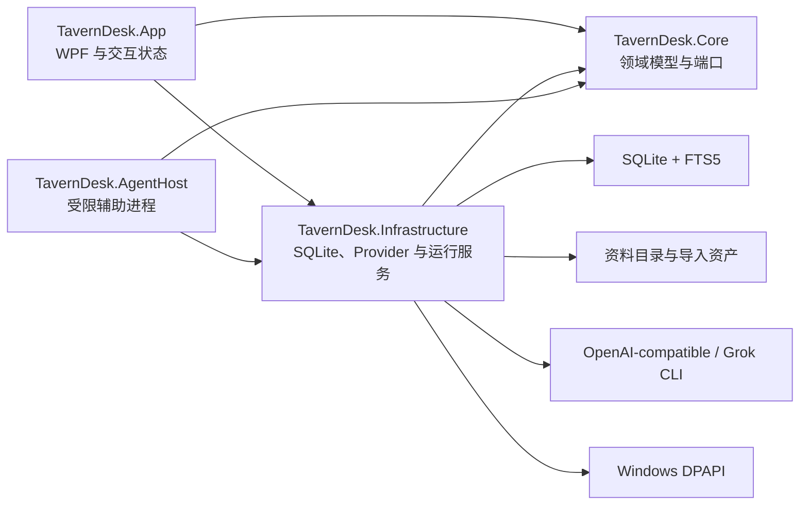
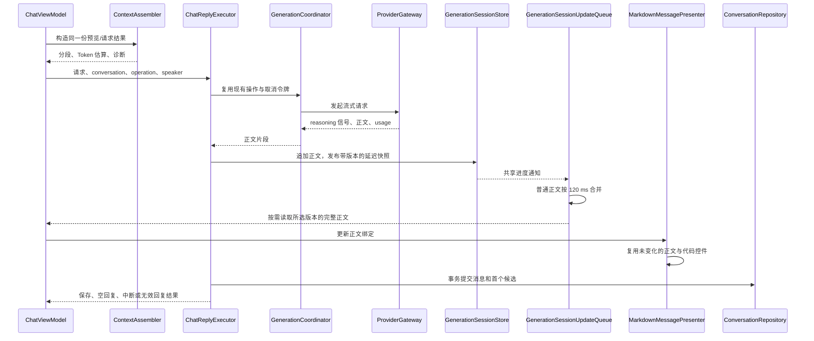
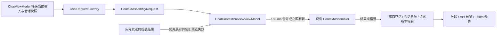
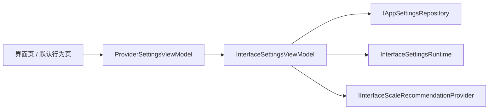
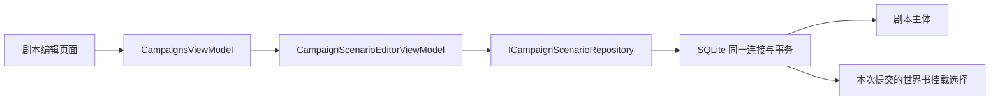

# TavernDesk 架构与维护指南

状态日期：2026-09-11（北京时间）

本文面向第一次阅读源码的维护者，说明当前系统如何分层、哪些边界不能破坏，以及从哪里开始定位代码。产品功能与安装方式以仓库根目录 README 为准；跑团规则见 [`campaign_mode_design.md`](campaign_mode_design.md)，跑团上下文与记忆参数见 [`TavernDesk-R2-B-Campaign-Context-Budget.md`](TavernDesk-R2-B-Campaign-Context-Budget.md)。

本地维护约定：`New-tavern` 是日常开发、验证和发布的主目录；`TavernDesk` 目录仅用于实验分支。实验成果经验证并合入主线后，正式构建从 `New-tavern` 生成。目录名不代表 Git 包含关系，检查同步时同时核对提交、实际文件和未提交改动。

## 1. 一页结论

TavernDesk 是 Windows 本地优先的 WPF 角色聊天与独立跑团客户端。当前架构已经形成可运行闭环，没有证据要求全应用重构。维护时优先做局部修复，并保护以下事实：

1. 角色卡、剧本卡和聊天导入必须尽量保留原始字段与容器资源，不能为方便编辑而重建并丢失未知数据。
2. 普通聊天、群聊和跑团有各自的持久化与记忆边界；跑团不是“群聊加 GM 提示词”。
3. 上下文预览与实际请求必须来自同一组装结果；超限时明确阻止或按既定预算裁剪历史，不能静默裁掉固定设定。
4. API Key 不进入 SQLite、导出文件或日志；模型请求只发送给用户主动选择的 Provider。
5. 所有生成共用一个应用级协调器；取消、失败、重试和迟到流片段必须有唯一终态。
6. 模型 reasoning 在基础设施边界归一化，只向界面提供临时状态，不进入消息、记忆或下一轮上下文。

## 2. 解决方案分层



### `TavernDesk.App`

- 主窗口、独立聊天窗口、对话框、导航、主题、缩放和多语言资源。
- ViewModel 负责界面状态和命令编排，不直接拼 SQL、不持有明文密钥、不自行实现 Provider 协议。
- 主窗口关闭是应用退出边界；关闭页面或子窗口不能顺带取消后台生成。
- 同一 Windows 桌面会话只允许一个主进程；独立聊天窗口由该进程创建。

### `TavernDesk.Core`

- 不依赖 WPF 或 SQLite。
- 保存角色、会话、消息、记忆、世界书、Provider、跑团及上下文预算等领域模型。
- 定义 Repository、Codec、Context、Memory、Retrieval、Campaign 等端口。
- 跑团流程策略和叙事权限策略位于 Core，使当前行动者、待裁定事件和回合推进只有一个权威来源。

### `TavernDesk.Infrastructure`

- SQLite schema 与迁移、文件导入导出、FTS5/Embedding 检索、Token 估算、Provider 网关和 DPAPI 密钥存储。
- 负责普通聊天与跑团的请求组装、流式归一化、持久化事务、记忆更新和失败收尾。
- 外部输入应在进入 Core 前解析、校验和归一化。

### `TavernDesk.AgentHost`

- 承载受限的辅助与存储冒烟能力。
- 不应演化为通用 Agent 平台、代码工作台或拥有无限文件权限的宿主。

## 3. 数据与持久化边界

当前数据库版本为 schema v23。维护者通常不需要记住每一列，只需先按职责定位：

| 数据域 | 主要对象 | 核心约束 |
| --- | --- | --- |
| 角色资产 | `characters`、书架及关联 | 原始卡片与未知字段可 round-trip；自定义书架只保存关联 |
| 普通聊天 | `conversations`、`messages`、`message_candidates` | `sequence_no` 是稳定顺序；删除确认后物理删除 |
| 记忆与群聊 | 角色记忆、群聊共同/成员记忆、草稿、检查点、群聊设置/成员/状态 | 三类正文彼此隔离；结构化自动更新与检查点在同一事务提交 |
| 检索与世界书 | FTS5、挂载关系、Embedding profile/向量 | 预览不触发远程 Embedding；删除和回滚保持索引一致 |
| Provider | profile、模型目录、功能分配 | SQLite 只存密钥引用；模型目录来源不等于能力判定 |
| 跑团 | scenario、campaign、participant、event | 与普通聊天物理隔离；事件日志是权威事实源 |
| 跑团记忆 | GM/Public memory 与 checkpoint | 是事件日志的派生投影，随所属跑团级联删除 |

### 必须保持的迁移语义

- `sequence_no` 是消息或事件域内的稳定顺序；业务逻辑不得重新依赖 SQLite `rowid`。
- `messages.is_deleted` 只为旧 schema 兼容保留。当前产品没有回收箱、软删除 UI 或恢复流程。
- 角色卡、CHARX、PNG、JSONL 和剧本卡导入应先完整解析与校验，再在事务中写入；失败不能留下半套记录。角色卡文件先暂存并发布到最终目录，再由 `SqliteCharacterImportStore` 在共享事务内提交角色、内嵌世界书和挂载；常规异常清理本次文件，进程强制退出可能留下无数据库引用的资产目录，不自动删除未知文件。JSON / PNG / CHARX 输入在分配大缓冲前及读取中执行大小限制；世界书最多 20,000 条目、JSON 深度 256。
- Provider 密钥轮换和删除都先保证数据库事务正确，再清理旧保护文件，避免数据库继续引用已删密钥。
- 设置页只记录待执行资料目录切换；下次取得单实例门闩后、构造业务服务前执行。复制写入目标同级暂存目录，SQLite backup 的两端连接禁用池化，释放句柄后移动目录并提交配置；失败时仍使用原目录，成功后保留原目录。中断副本在重试时保留为同级 `.name.incomplete-<id>`，重新从原目录复制最新数据。
- 跑团开始时冻结角色、Persona、可选普通记忆、世界规则、叙事权限与模型路由。之后编辑源角色或剧本不能悄悄改变进行中的局。
- 新迁移必须拒绝打开高于当前软件支持版本的数据库，不能自动降级或猜测回滚。

## 4. 主要运行链路

### 4.1 启动与资料目录

```text
单实例门闩
→ 解析配置并执行待处理资料目录切换（外部覆盖时跳过）
→ 构造指向最终资料目录的业务服务
→ 初始化/迁移 SQLite
→ 初始化默认 Provider 与契约修复
→ 应用语言、主题和缩放
→ 构造主窗口与长生命周期服务
```

全新资料目录需要完成一次界面语言选择；旧数据库缺少语言设置时保持简体中文。Provider 初始化可以补齐缺失的内置项或停用无法安全恢复的旧适配器记录，但不能自动刷新模型目录或复活用户已经删除的默认 Provider。

### 4.2 普通聊天生成



- 普通正文通知按 120 毫秒合并，消费时才生成完整字符串，按 conversation / operation / message 隔离；首段、思考及完成等状态及时刷新。会话切换可直接读取当前快照，旧通知保留当时的正文前缀，不会读到下一条回复。
- Markdown 仍使用原有轻量语法，每次更新扫描全文；复用未变化的 WPF 控件，正文和代码文本以每组最多 32 个物理行为单位更新。完整替换消息、切换主题及字号变化会更新相应内容。这是增量更新显示控件，不是增量解析器；单个超长物理行仍可能有较高的布局成本。
- 不同会话可并发生成；同一会话拒绝重入。
- 多个窗口可以附着同一会话生成快照；关闭一个展示窗口不等于取消请求。
- 助手消息与首个候选必须在同一事务提交，不能留下“有消息、无候选”的半状态。
- 停止、Provider 错误和正常完成竞争时，第一个终态胜出；迟到片段不得再次提交数据。

2026-09-05 起，单条新回复的流接收、正文检查与消息/首候选提交由 `Infrastructure/Context/ChatReplyExecutor.cs` 执行。该类不依赖 WPF、ViewModel 或界面回调；应用装配共享实例，继续使用原有协调器和会话存储。`ChatViewModel` 保留上下文准备、操作登记/收尾、界面文案、群聊接力及记忆触发。群聊仍调用同一单条回复入口，原有归属清洗规则不变；重新生成只复用流读取，候选替换提交仍保留原规则。执行类不会提前结束整次发送/接力会话，不新增状态存储、队列或框架。

2026-09-11 起，会话分组、筛选、展开状态和角色缓存归 `ConversationBrowserViewModel`；上下文请求映射、Provider 请求构造和 API 预览归 `ChatRequestFactory`。`ChatViewModel` 继续拥有窗口选择、取消和业务编排。共享会话存储新增可选的延迟通知接口，旧 `SessionChanged` 订阅及 `Get` 返回值保持完整快照语义；显示队列负责订阅和释放，未引入第二级节流、数据库变更或新的渲染依赖。

### 4.3 普通聊天上下文

`ChatContextPreviewViewModel` 由每个聊天窗口持有，统一管理 150 ms 预览刷新、取消、版本校验、分段/API 预览和预算展示。`ChatViewModel` 在会话资料就绪后捕获请求快照，继续拥有会话加载与发送编排；原有 XAML 绑定通过只读属性转发，不传入整个主 ViewModel，也不创建新的全局状态。



切换会话或开始新的预览会取消前次请求并推进版本，A→B→A 也不能接收旧 A 的结果或错误。实际请求预算优先于预览估算；同一会话完成后的重新加载保留实际预算，用户编辑输入或切换到其他会话后允许新预览更新预算。关闭窗口停止发布，并等待仍未完成的预览（包括被新请求取代但未响应取消的工作），不取消应用级 Provider 生成。

当前稳定顺序为：

```text
安全与格式规则
→ global / character / conversation 预设
→ 群聊附加规则
→ Persona、当前角色和群聊成员资料
→ 世界书 before / after / at-depth 注入
→ 角色或群聊记忆
→ 近期历史
→ FTS5 / 语义召回
→ post-history 与群聊接力指令
→ 当前输入
→ Token 估算与发送门禁
```

固定前缀尽量靠前，逐轮变化内容靠后，以便兼容 Provider 前缀缓存。预览和发送复用相同的请求映射与上下文组装器；预览禁用远程语义召回，实际发送按配置执行，因此两次估算可能不同，发送预算展示优先采用实际请求的组装结果。已知 OpenAI tokenizer 使用内置词表，未知模型明确标记为启发式估算；服务端模板仍可能造成误差，因此不能把本地估算描述为精确计费结果。

### 4.4 记忆与检索

- 角色固有长期记忆、群聊共同记忆、每角色的群聊独立记忆和跑团记忆分别存储，不共享实时正文。群聊自动更新既不读取也不写入角色固有长期记忆。
- 群聊生成只注入共同记忆和当前发言角色在该群聊中的独立记忆；不会向当前角色注入其他成员的独立记忆。关闭角色独立群聊记忆后，已有独立正文也停止注入和自动更新。
- 一次完整群聊接力结束后，按完整保存的消息数或待处理 Token 估算阈值检查更新，因此没有新 USER 消息的纯角色接力也能被处理。模型必须返回带来源序号的结构化 JSON；解析、长度或来源校验失败时，整批正文与检查点均不落盘。
- 群聊运行时接力固定按启用成员顺序推进；完全自动接力在上一条回复完成后继续，顶部成员头像的“立即接话”可强制指定角色。模型输出的 `@` 文本不会选择下一位角色，也不会触发用户暂停。软件不再提供或读取 `@` 接力、随机接力和手动接力模式。
- 已处理消息发生编辑、删除或候选切换时，来源摘要不一致会让共同记忆和角色独立记忆仅依据当前消息重建。
- 普通记忆更新、压缩和群聊合并各只有一份全局职责模板；动态输入由代码构造，不恢复第二套 User 模板。
- 普通角色记忆的自动阈值更新直接提交；手动生成仍形成可编辑草稿。把群聊记忆合并到角色固有长期记忆也始终先生成草稿，只有用户明确保存后才会改变角色记忆。
- 群聊分支复制消息、候选、设置、成员、群聊记忆开关/阈值及自动更新工作流设置，但不复制原群聊已经生成的记忆、检查点或草稿，避免分支后信息泄漏。
- 群聊记忆更新按会话串行合并；更新期间新增、编辑或删除消息，以及人工保存记忆，都会使旧快照失效并触发重算。自动保存使用记忆版本和来源指纹双重校验，不能覆盖更新期间保存的人工正文。
- 单次检查最多处理三批；仍有积压时明确返回“部分更新”，保留已验证检查点，后续消息触发或手动检查会继续处理。若历史被删空，共同记忆、成员记忆和检查点一并清空。
- 世界书支持确定性规则、FTS5 与可选 Embedding 混合召回；本地预览不得产生远程向量请求。

### 4.5 跑团

跑团使用独立事件流、流程策略、上下文 Planner、GM/Public 记忆和叙事权限校验。`CampaignRunner` 负责 Provider、事务、终态、重试与记忆调度；策略只计算允许行动者和推进计划，不执行外部副作用。完整规则见 [`campaign_mode_design.md`](campaign_mode_design.md)。

## 5. Provider 与安全边界

- Grok CLI 使用本机订阅登录与专用 ACP 路径；其余内置和自定义入口使用 OpenAI-compatible 边界。
- OpenAI-compatible 基地址可以是服务根、`/v1` 或 `/api/v1`，不能在设置中追加 `/chat` 或 `/chat/completions`。
- 模型目录只在用户主动刷新时请求；TavernDesk 不下载或运行本地模型。
- API Key 使用 Windows DPAPI `CurrentUser` 保护文件保存，SQLite 只保存受校验的随机引用。
- DPAPI 能降低数据库、备份或单独文件泄漏造成的明文暴露，但不能抵御同一 Windows 用户上下文中的恶意程序、管理员或被控制的运行进程。
- “本地优先”不等于生成离线：聊天或 Embedding 请求会把必要上下文发送给用户所选服务。
- 原始 reasoning、API Key、用户数据和私有跑团事件不得进入普通日志或公开诊断。
- 普通错误日志写入 `%LOCALAPPDATA%\TavernDesk\logs`，只保留错误类别、异常类型、脱敏调用栈和有限状态；异常正文默认省略，单文件最多 10 MiB，最多保留 10 个。
- API 测试模式默认关闭并通过应用设置持久化。开启后由 `ProviderGatewayRouter` 统一把模型目录、聊天和 Embedding 的逻辑请求与规范化回复写入软件根目录相对路径 `tests\output`；授权信息、隐藏 reasoning 原文和完整向量不得进入记录，总量超过 500 MiB 时删除最旧记录。
- 测试输出属于可丢弃的安装目录诊断文件，清空只允许删除 `tests\output` 的直接子项并保留目录；安装版卸载会删除安装清单内的程序文件及整个 `tests\output`，但保留安装目录中不属于 TavernDesk 的其他文件，也不影响独立个人资料目录。

## 6. UI 与状态原则

- 一个状态只保留一个主要控件；关键操作不能依赖固定像素位置。
- 书架目录状态与角色详情会话分离；迟到的异步读取提交前必须匹配会话 ID 和角色 ID。
- 正式资料与未保存草稿分离；切换、关闭或进入聊天前统一处理未保存内容。
- 消息工具条由稳定消息 ID 定位，不能依赖虚拟化行号。
- 主窗口、独立聊天与应用内对话框共享主题、语言和缩放资源，但各自保留必要的窗口尺寸状态。
- 跑团页面只有剧本库、准备大厅和游戏桌面三类主状态；开始后配置冻结，只开放明确允许的局内设置。
- 不为局部界面问题增加全局 Store、事件总线、通用状态机、第二套生成主管或新依赖注入框架。

### 界面设置的职责边界

`ProviderSettingsViewModel` 持有 `InterfaceSettingsViewModel`，并转发原有属性、命令与属性变化通知，保持界面页和默认行为页的绑定兼容。子组件独立管理主题、字体、缩放、语言、自动滚动、缩放建议、加载、保存和恢复默认值；Provider 配置、模型分配、资料目录与诊断仍由父组件管理。



主题和缩放在选择后即时预览；保存后应用字体和自动滚动，语言偏好在下次启动时生效。恢复默认值会修改编辑状态并预览主题、缩放，但仍需保存才会写入数据库。现有 `ui.*` 设置键不变；仅在首次缺少缩放设置时持久化显示器建议，已保存的缩放值不会被建议覆盖。

### 剧本编辑与事务边界

`CampaignsViewModel` 负责页面导航、选择和忙碌状态，通过原有属性转发保持 XAML 绑定兼容；`CampaignScenarioEditorViewModel` 管理剧本字段、叙事权限、世界书勾选与未保存草稿。保存时从原记录复制来源元数据并构造独立对象，避免失败写入污染剧本库中的已保存对象。



`SaveWithWorldbookBindingsAsync` 将剧本主体与本次提交的挂载新增、更新和删除放入同一事务；未提交的世界书与其他作用域不变。不引入通用工作单元，也不改变 schema。任一写入失败时全部回滚，新建剧本不会留下空记录；编辑器保留草稿供重试。保存成功后刷新剧本库并退出编辑，返回剧本库则放弃未保存修改。原始卡片元数据和已开始跑团的冻结快照沿用既有边界。

## 7. 代码定位

| 任务 | 首选入口 |
| --- | --- |
| 应用启动、单实例、语言 | `src/TavernDesk.App/App.xaml.cs`、`LanguageRuntime.cs` |
| 主窗口与服务装配 | `src/TavernDesk.App/ViewModels/MainWindowViewModel.cs`、`src/TavernDesk.Infrastructure/InfrastructureServices.cs` |
| 角色书架 | `src/TavernDesk.App/ViewModels/CharactersViewModel.cs` |
| 界面设置与即时预览 | `src/TavernDesk.App/ViewModels/InterfaceSettingsViewModel.cs` |
| 普通聊天 | `src/TavernDesk.App/ViewModels/ChatViewModel.cs` |
| 会话列表与请求构造 | `src/TavernDesk.App/ViewModels/ConversationBrowserViewModel.cs`、`src/TavernDesk.App/Services/ChatRequestFactory.cs` |
| 聊天上下文预览与预算展示 | `src/TavernDesk.App/ViewModels/ChatContextPreviewViewModel.cs` |
| 流式快照与显示 | `src/TavernDesk.Infrastructure/Context/ConversationGenerationSessionStore.cs`、`src/TavernDesk.App/Presentation/GenerationSessionUpdateQueue.cs`、`MarkdownMessagePresenter.cs`、`MarkdownMessageBlocks.cs` |
| 普通上下文 | `src/TavernDesk.Infrastructure/Context/BasicContextAssembler.cs` |
| Provider | `src/TavernDesk.Infrastructure/Providers/` |
| 错误日志与 API 测试记录 | `src/TavernDesk.Infrastructure/Diagnostics/`、`ProviderGatewayRouter.cs` |
| 会话与 schema | `src/TavernDesk.Infrastructure/Storage/SqliteConversationRepository.cs`、`SqliteDatabase.cs` |
| 世界书与检索 | `src/TavernDesk.Infrastructure/Knowledge/`、`Retrieval/` |
| 跑团界面 | `src/TavernDesk.App/ViewModels/CampaignsViewModel.cs` |
| 剧本草稿与原子保存 | `src/TavernDesk.App/ViewModels/CampaignScenarioEditorViewModel.cs`、`src/TavernDesk.Infrastructure/Storage/SqliteCampaignScenarioRepository.cs` |
| 跑团流程 | `src/TavernDesk.Core/Campaign/Flow/` |
| 跑团执行与上下文 | `src/TavernDesk.Infrastructure/Campaign/` |
| 自动化测试 | `tests/TavernDesk.Tests/` |

## 8. 当前证据与未验证边界

### 隔离测试入口（2026-09-07）

在仓库根目录使用 PowerShell 7，日常测试复用专用虚构资料库，不复制或打开个人数据库：

```powershell
# 构建当前源码，复用固定测试资料并打开已有角色主页。
& .\scripts\Start-IsolatedTest.ps1

# 仅在需要新增测试卡时指定文件；每次显式传入都会执行一次导入。
& .\scripts\Start-IsolatedTest.ps1 -CharacterCard 'I:\New-tarven\work\TAVERN-TEST\cards\card-v3.json'

# 验证从零开始的首次启动和语言选择，保留固定资料。
& .\scripts\Start-IsolatedTest.ps1 -Fresh

# 无界面初始化检查：初始化 SQLite 和基础服务，写结果，然后退出。
& .\scripts\Start-IsolatedTest.ps1 -StartupProbe
```

脚本使用已有 SDK 和依赖，执行 Release `--no-restore` 构建，直接运行源码输出中的 `TavernDesk.App.exe`；不会更新根目录 `app/`、安装包或 `TavernDesk.exe`。默认复用 `work/TAVERN-TEST/profile/`；其同级 `cards/` 放测试卡，`exports/` 放导出结果，`evidence/` 放验证记录。仅 `-Fresh` 或 `-StartupProbe` 在 `work/isolated-test-<时间>-<随机 ID>/` 下新建目录。每份测试资料包含：

- `data/`：专用测试数据库、资产、密钥目录；日常重启保留角色和设置。
- `config/`：测试配置位置；启动时不会读取个人 `config.json`，没有保存配置时文件可以不存在。
- `logs/`：测试错误日志；API 测试输出路径为本次目录中的 `tests/output/`，API 测试模式默认关闭。
- `startup-result.json`：进程 ID、实际路径、schema 版本与初始化状态，不包含聊天正文或密钥。

应用仅在显式 `--test-root <绝对路径>` 下启用测试模式。复用已有目录必须额外传入 `--test-reuse`，并验证应用创建的专用目录标记及其中记录的完整路径；拒绝未标记目录、链接祖先或目录内链接、混用 `--data-root` 及不完整参数。`--test-startup-probe` 和 `--test-character-card` 必须配合测试根使用。固定模式首次默认中文，之后保留语言选择；已有角色时直接打开角色主页，显式测试卡经正式导入服务导入。`-Fresh` 保留首次语言选择流程。

保持原有单实例约束：启动前先关闭已有窗口；已有实例运行时测试会失败退出，不附着或停止已有实例。主窗口带 `[TEST]` 标记。脚本只接受本次进程的回执，交互模式等待 `window-shown`；超时或校验失败时只终止自己创建的进程，保留测试目录供检查，不自动递归删除。

注意：根目录薄启动器不转发参数，不能用 `TavernDesk.exe --data-root ...` 或 `--test-root ...` 作为测试入口。

| 验证层级 | 能证明什么 | 不能证明什么 |
| --- | --- | --- |
| 根启动器 `--probe` | `app/TavernDesk.App.exe` 文件存在 | 依赖完整、程序启动、数据库或 UI 正常 |
| `Start-IsolatedTest.ps1 -StartupProbe` | 当前源码构建成功，隔离 SQLite/基础服务初始化成功，进程正常退出 | 主窗口交互、真实 Provider、个人旧库迁移 |
| `Start-IsolatedTest.ps1` | 返回 `initialized` 表示基础服务初始化；`window-shown` 表示主窗口已显示 | 按钮操作、完整业务或视觉验收通过 |
| 私有回归测试及人工验收 | 各自实际执行的场景 | 未执行的 Provider、长局或高 DPI 场景 |

`tests/` 继续排除于 Git，本地验证记录应附源码版本、工作区差异和实际命令。初始化检查不调用 Provider；交互测试不得自行配置真实凭据或调用付费模型。

### 历史验证快照

以下是工作记录中的最近可信快照，不代表任何未提交工作区修改已经通过同等验证：

- 2026-09-11（剧本编辑与原子保存）：Release 私有测试 `305/305`。新增两项真实 SQLite 回归覆盖已有剧本主体与挂载中途失败的完整回滚、保留草稿后重试，以及新建失败不留记录并沿用草稿 ID 重试。首项先在旧实现中复现部分写入，再验证修复。真实主窗口完成五个编辑页签、字段与权限保存、挂载切换、故障提示、重试、重新打开和取消新建/修改；绑定与 Dispatcher 错误均为零。使用专用虚构资料，未调用真实 Provider。
- 2026-09-11（预览职责拆分）：Release 私有测试 `301/301`，其中新增 3 项可控异步场景，覆盖旧输入与 A→B→A、实际预算优先级和关闭后的迟到结果/错误。真实 WPF 窗口配合专用虚构资料、可控预览组装器和本地流式替身，验证快速输入合并、迟到 A 预览不覆盖 B、实际预算不被迟到预览覆盖、待处理预览窗口关闭后零属性通知，并复验发送、切换、停止、持久化及浅/深色主题；绑定与 Dispatcher 错误均为零。未调用真实 Provider。
- 2026-09-11：本次流式显示与聊天职责拆分的 Release 私有测试 `298/298`、四语资源校验和隔离启动初始化通过。真实 WPF 窗口使用专用虚构资料与本地流式替身，验证发送、会话切换、重新附着、关闭第二窗口、停止及浅/深色主题，绑定与 Dispatcher 错误均为零。完整套件首次有一项固定 300 ms 等待的加载测试未及时完成，改为等待实际就绪状态并保留超时后复验通过。
- 同次本机流式对比覆盖 16K/64K/128K 正文和 64K 代码，最终文本均一致。128K 正文的生产线程分配从约 128.5 MiB 降至 0.67 MiB，累计正文绑定更新耗时从约 18.3 s 降至 0.28 s；64K 代码的累计布局耗时从约 1.23 s 降至 0.20 s。固定片段与发送节奏下各单次运行，快照改为在显示端按需生成，因此生产线程分配不等于全进程分配；结果不代表真实 Provider 延迟或所有硬件的收益。五组新旧渲染行距比较一致。
- 2026-08-14：群聊回复归属抬头清洗、固定顺序/头像强制接话、四语静态校验、Release 构建、280 项私有测试、长历史离线脚本和根启动探针通过；未调用真实 Provider。
- 2026-08-11：四语静态校验、Debug/Release 构建和隔离存储 smoke 通过；English 首次启动与实际 EXE 人工短验收完成；发布目录与根启动探针已核对。
- 2026-08-09：当时的完整 Release 测试为 `188/188`，另有 SQLite 事务回滚定向回归；发布探针通过。
- Appica 主工作区曾在 Windows 150% DPI 下完成真实像素与点击验收，但后续局部 UI 变更仍需按变更点复核。

仍缺少等价证据的范围：

- 简体中文、台湾繁中和日语的完整首次启动、长文本换行与高 DPI 人工验收；
- OpenRouter、硅基流动、DeepSeek 官方 API、当前 LM Studio 地址和 Grok CLI 的真实账号短链路；
- 10–20 轮真实跑团、记忆 ON/OFF、上下文裁剪与多模型失败重试；
- 大型真实数据库迁移、长列表性能、键盘无障碍和强制结束进程后的恢复体验。

文档修改本身不能证明源码构建或测试仍通过。只有实际执行过的命令才能写入新的验证结论，详细时间线继续追加到 [`codex_worklog.md`](codex_worklog.md)。

## 9. 维护顺序

1. 先读根 README，确认产品功能和用户入口。
2. 再读本文，确定模块、数据和生命周期边界。
3. 涉及跑团时读 [`campaign_mode_design.md`](campaign_mode_design.md)；涉及预算或记忆调试时再读 [`TavernDesk-R2-B-Campaign-Context-Budget.md`](TavernDesk-R2-B-Campaign-Context-Budget.md)。
4. 只在需要历史证据、旧故障或某次验证细节时搜索 [`codex_worklog.md`](codex_worklog.md)，不要把流水记录重新塞回入口文档。
5. 修改后先运行最接近变更点的测试，再按风险扩大；记录已通过、失败和未验证范围，不用旧快照替代当前验证。
